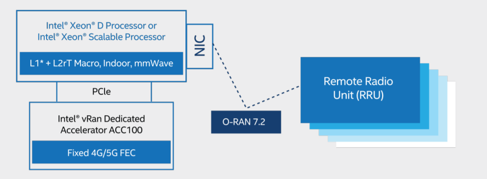

```text
SPDX-License-Identifier: Apache-2.0
Copyright (c) 2020-2021 Intel Corporation
```
<!-- omit in toc -->
# OpenNESS Operator for Intel® ACC100

- [Overview](#overview)
- [Intel® vRAN Dedicated Accelerator ACC100](#intel-vran-dedicated-accelerator-acc100)
- [Intel® vRAN Dedicated Accelerator ACC100 FlexRAN Host Interface Overview](#intel-vran-dedicated-accelerator-acc100-flexran-host-interface-overview)
- [OpenNESS Operator for Intel® vRAN Dedicated Accelerator ACC100](#openness-operator-for-intel-vran-dedicated-accelerator-acc100)
  - [OpenNESS Operator for Intel® vRAN Dedicated Accelerator ACC100 (Wireless FEC Acceleration)](#openness-operator-for-intel-vran-dedicated-accelerator-acc100-wireless-fec-acceleration)
    - [FEC Configuration](#fec-configuration)
    - [SRIOV Device Plugin](#sriov-device-plugin)
- [Managing NIC Devices](#managing-nic-devices)
- [Technical Requirements and Dependencies](#technical-requirements-and-dependencies)
- [Deploying the Operator](#deploying-the-operator)
  - [Install the Bundle](#install-the-bundle)
  - [Applying Custom Resources](#applying-custom-resources)
- [Hardware Validation Environment](#hardware-validation-environment)
- [Summary](#summary)
- [Appendix 1 - Developer Notes](#appendix-1---developer-notes)
  - [Uninstalling Previously Installed Operator](#uninstalling-previously-installed-operator)
  - [Setting Up Operator Registry Locally](#setting-up-operator-registry-locally)

## Overview

This document details the support of Intel® vRAN Dedicated Accelerator ACC100 card in Red Hat's OpenShift Container Platform, using a Special Resource Operator framework based on the Operator SDK project.

## Intel® vRAN Dedicated Accelerator ACC100

Intel® vRAN Dedicated Accelerator ACC100 plays a key role in accelerating 4G and 5G Virtualized Radio Access Networks (vRAN) workloads, which in turn increases the overall compute capacity of a commercial, off-the-shelf platform.

Intel® vRAN Dedicated Accelerator ACC100 provides the following features:

- LDPC FEC processing for 3GPP 5G:
  - LDPC encoder/decoder
  - Code block CRC generation/checking
  - Rate matching/de-matching
  - HARQ buffer management
- Turbo FEC processing for 3GPP 4G:
  - Turbo encoder/decoder
  - Code block CRC generation/checking
  - Rate matching/de-matching
- Scalable to required system configuration
- Hardware DMA support
- Performance monitoring
- Load balancing supported by the hardware queue manager (QMGR)
- Interface through the DPDK BBDev library and APIs

Intel® vRAN Dedicated Accelerator ACC100 benefits include:
- Reduced platform power, E2E latency and Intel® CPU core count requirements as well as increase in cell capacity than existing programmable accelerator
- Accelerates both 4G and 5G data concurrently
- Lowers development cost using commercial off the shelf (COTS) servers
- Accommodates space-constrained implementations via a low-profile PCIe* card form factor
- Enables a variety of flexible FlexRAN deployments from small cell to macro to Massive
MIMO networks
- Supports extended temperature for the most challenging of RAN deployment scenarios

For more information, see product brief in [Intel® vRAN Dedicated Accelerator ACC100](https://builders.intel.com/docs/networkbuilders/intel-vran-dedicated-accelerator-acc100-product-brief.pdf).

## Intel® vRAN Dedicated Accelerator ACC100 FlexRAN Host Interface Overview

FlexRAN is a reference layer 1 pipeline of 4G eNb and 5G gNb on Intel® architecture. The FlexRAN reference pipeline consists of an L1 pipeline, optimized L1 processing modules, BBU pooling framework, cloud and cloud-native deployment support, and accelerator support for hardware offload. Intel® vRAN Dedicated Accelerator ACC100 card is used by FlexRAN to offload FEC (Forward Error Correction) for 4G and 5G.

Intel® vRAN Dedicated Accelerator ACC100 card used in the FlexRAN solution exposes the following physical functions to the CPU host:
- One FEC interface that can be used of 4G or 5G FEC acceleration
  - The LTE FEC IP components have turbo encoder/turbo decoder and rate matching/de-matching
  - The 5GNR FEC IP components have low-density parity-check (LDPC) Encoder / LDPC Decoder, rate matching/de-matching, and UL HARQ combining



## OpenNESS Operator for Intel® vRAN Dedicated Accelerator ACC100

The role of the operator for the Intel® vRAN Dedicated Accelerator ACC100 card is to orchestrate and manage the resources/devices exposed by the card within the OpenShift cluster. The operator is a state machine which will configure the resources and then monitor them and act autonomously based on the user interaction.
The operator design for Intel® vRAN Dedicated Accelerator ACC100 consist of:

* OpenNESS Operator for Intel® vRAN Dedicated Accelerator ACC100 (Wireless FEC Acceleration)

### OpenNESS Operator for Intel® vRAN Dedicated Accelerator ACC100 (Wireless FEC Acceleration)

This operator handles the management of the FEC devices used to accelerate the FEC process in vRAN L1 applications - the FEC devices are provided by Intel® vRAN Dedicated Accelerator ACC100 eASIC card. It provides functionality to create desired VFs (Virtual Functions) for the FEC device, binds them to appropriate drivers and configures the VF's queues for desired functionality in 4G or 5G deployment. It also deploys an instance of the SR-IOV Network device plugin which manages the FEC VFs as an OpenShift cluster resource and configures this device plugin to detect the resources. The user interacts with the operator by providing a CR (CustomResource). The operator constantly monitors the state of the CR to detect any changes and acts based on the changes detected. The CR is provided per cluster configuration. The components for individual nodes can be configured by specifying appropriate values for each component per "nodeName". Once the CR is applied or updated, the operator/daemon checks if the configuration is already applied, and, if not it binds the PFs to driver, creates desired amount of VFs, binds them to driver and runs the [pf-bb-config utility](https://github.com/intel/pf-bb-config) to configure the VF queues to the desired configuration.

This operator is a common operator for FEC device/resource management to ["OpenNESS Operator for Intel® FPGA PAC N3000 (Wireless FEC Acceleration)"](https://github.com/otcshare/openshift-operator/blob/master/spec/openshift-pacn3000-operator.md) provided as part of "OpenNESS Operator for Intel® FPGA PAC N3000" operator bundle.

An example CR for the SRIOV FEC operator:

```yaml
apiVersion: sriovfec.intel.com/v1
kind: SriovFecClusterConfig
metadata:
  name: config
spec:
  nodes:
    - nodeName: <NODE_NAME>
      physicalFunctions:
        - pciAddress: <CARD_PCI>
          pfDriver: "pci-pf-stub"
          vfDriver: "vfio-pci"
          vfAmount: 16
          bbDevConfig:
            acc100:
              # Programming mode: 0 = VF Programming, 1 = PF Programming
              pfMode: false
              numVfBundles: 16
              maxQueueSize: 1024
              uplink4G:
                # Number of queue groups configured for 4G Uplink out of 8 available.
                numQueueGroups: 0
                numAqsPerGroups: 16
                aqDepthLog2: 4
              downlink4G:
                # Number of queue groups configured for 4G Downlink out of 8 available.
                numQueueGroups: 0
                numAqsPerGroups: 16
                aqDepthLog2: 4
              uplink5G:
                # Number of queue groups configured for 5G Uplink out of 8 available.
                numQueueGroups: 4
                numAqsPerGroups: 16
                aqDepthLog2: 4
              downlink5G:
                # Number of queue groups configured for 5G Downlink out of 8 available.
                numQueueGroups: 4
                numAqsPerGroups: 16
                aqDepthLog2: 4
```

The workflow of the SRIOV FEC operator is shown in the following diagram:


#### FEC Configuration

The Intel® vRAN Dedicated Accelerator ACC100 eASIC card exposes a FEC PF device which is to be bound to PCI-PF-STUB driver in order to enable creation of the FEC VF devices. Once the FEC PF is bound to the correct driver, the user can create up to 16 VF devices to be used in Cloud Native deployment of vRAN to accelerate FEC. It is advised to create all 16 VFs. Once these devices are created they are to be bound to a user-space driver such as VFIO-PCI in order for them to work and be consumed in vRAN application pods. Before the device can be used by the application, the device needs to be configured - notably the mapping of queues exposed to the VFs - this is done via pf-bb-config application with the input from the CR used as a configuration. The card is configured to provide up to 8 queue groups with up to 16 queues per group. The queue groups can be divided between groups allocated to 5G/4G and Uplink/Downlink, it can be configured for 4G or 5G only, or both 4G and 5G at the same time. Each configured VF has access to all the queues. Each of the queue groups has a distinct priority level. The request for given queue group is made from application level (ie. vRAN application leveraging the FEC device).

To get all the nodes containing the Intel® vRAN Dedicated Accelerator ACC100 card run the following command (all the commands are run in the `vran-acceleration-operators` namespace):
```shell
[user@ctrl1 /home]# oc get sriovfecnodeconfig
NAME             CONFIGURED
node1            Succeeded
```

To find the PF of the SRIOV FEC accelerator device to be configured, run the following command:

```shell
[user@ctrl1 /home]# oc get sriovfecnodeconfig node1 -o yaml

***
status:
  conditions:
  - lastTransitionTime: "2021-03-19T17:19:37Z"
    message: Configured successfully
    observedGeneration: 1
    reason: ConfigurationSucceeded
    status: "True"
    type: Configured
  inventory:
    sriovAccelerators:
    - deviceID: 0d5c
      driver: ""
      maxVirtualFunctions: 16
      pciAddress: 0000:af:00.0
      vendorID: "8086"
      virtualFunctions: []
```

To configure the FEC device with desired setting create a CR (An example below configures 8/8 queue groups for 5G, 4 queue groups for Uplink and another 4 queues groups for Downlink):

```yaml
apiVersion: sriovfec.intel.com/v1
kind: SriovFecClusterConfig
metadata:
  name: config
spec:
  nodes:
    - nodeName: node1
      physicalFunctions:
        - pciAddress: 0000:af:00.0
          pfDriver: "pci-pf-stub"
          vfDriver: "vfio-pci"
          vfAmount: 16
          bbDevConfig:
            acc100:
              # Programming mode: 0 = VF Programming, 1 = PF Programming
              pfMode: false
              numVfBundles: 16
              maxQueueSize: 1024
              uplink4G:
                numQueueGroups: 0
                numAqsPerGroups: 16
                aqDepthLog2: 4
              downlink4G:
                numQueueGroups: 0
                numAqsPerGroups: 16
                aqDepthLog2: 4
              uplink5G:
                numQueueGroups: 4
                numAqsPerGroups: 16
                aqDepthLog2: 4
              downlink5G:
                numQueueGroups: 4
                numAqsPerGroups: 16
                aqDepthLog2: 4
```

To apply the CR run:

```shell
[user@ctrl1 /home]# oc apply -f <sriovfec_cr_name>.yaml
```

After creation of the CR, the SRIOV FEC daemon starts configuring the FEC device. Once the SRIOV FEC configuration is complete, the following status is reported:

```shell
[user@ctrl1 /home]# oc get sriovfecnodeconfig
NAME             CONFIGURED
node1            Succeeded
```

From SRIOV FEC daemon pod, the user should see logs similar to the output below, if the VF queues were successfully programmed:
```shell
[user@ctrl1 /home]# oc get pod | grep sriov-fec-daemonset
sriov-fec-daemonset-h4jf8                      1/1     Running   0          19h

[user@ctrl1 /home]# oc logs sriov-fec-daemonset-h4jf8

***
2021-03-19T11:46:20.402Z        INFO    daemon.drainhelper.cordonAndDrain()     node drained
2021-03-19T11:46:20.402Z        INFO    daemon.drainhelper.Run()        worker function - start
2021-03-19T11:46:20.489Z        INFO    daemon.NodeConfigurator.applyConfig     current node status     {"inventory": {"sriovAccelerators":[{"vendorID":"8086","deviceID":"0d5c","pciAddress":"0000:af:00.0","driver":"pci-pf-stub","maxVirtualFunctions":16,"virtualFunctions":[{"pciAddress":"0000:b0:00.0","driver":"vfio-pci","deviceID":"0d5d"}]}]}}
2021-03-19T11:46:20.489Z        INFO    daemon.NodeConfigurator.applyConfig     configuring PF  {"requestedConfig": {"pciAddress":"0000:af:00.0","pfDriver":"pci-pf-stub","vfDriver":"vfio-pci","vfAmount":16,"bbDevConfig":{"acc100":{"pfMode":false,"numVfBundles":16,"maxQueueSize":1024,"uplink4G":{"numQueueGroups":0,"numAqsPerGroups":16,"aqDepthLog2":4},"downlink4G":{"numQueueGroups":0,"numAqsPerGroups":16,"aqDepthLog2":4},"uplink5G":{"numQueueGroups":4,"numAqsPerGroups":16,"aqDepthLog2":4},"downlink5G":{"numQueueGroups":4,"numAqsPerGroups":16,"aqDepthLog2":4}}}}}
2021-03-19T11:46:20.489Z        INFO    daemon.NodeConfigurator.loadModule      executing command       {"cmd": "/usr/sbin/chroot /host/ modprobe pci-pf-stub"}
2021-03-19T11:46:20.492Z        INFO    daemon.NodeConfigurator.loadModule      commands output {"output": ""}
2021-03-19T11:46:20.492Z        INFO    daemon.NodeConfigurator.loadModule      executing command       {"cmd": "/usr/sbin/chroot /host/ modprobe vfio-pci"}
2021-03-19T11:46:20.495Z        INFO    daemon.NodeConfigurator.loadModule      commands output {"output": ""}
2021-03-19T11:46:21.532Z        LEVEL(-2)       daemon.NodeConfigurator device is bound to driver       {"path": "/sys/bus/pci/devices/0000:af:00.0/driver"}
2021-03-19T11:46:21.532Z        LEVEL(-2)       daemon.NodeConfigurator driver to unbound device from   {"pciAddress": "0000:af:00.0", "driver": "/sys/bus/pci/drivers/pci-pf-stub"}
2021-03-19T11:46:21.532Z        INFO    daemon.NodeConfigurator device's driver_override path   {"path": "/sys/bus/pci/devices/0000:af:00.0/driver_override"}
2021-03-19T11:46:21.532Z        INFO    daemon.NodeConfigurator driver bind path        {"path": "/sys/bus/pci/drivers/pci-pf-stub/bind"}
2021-03-19T11:46:21.703Z        INFO    daemon.NodeConfigurator device's driver_override path   {"path": "/sys/bus/pci/devices/0000:b0:00.0/driver_override"}
2021-03-19T11:46:21.703Z        INFO    daemon.NodeConfigurator driver bind path        {"path": "/sys/bus/pci/drivers/vfio-pci/bind"}
2021-03-19T11:46:21.704Z        INFO    daemon.NodeConfigurator device's driver_override path   {"path": "/sys/bus/pci/devices/0000:b0:00.1/driver_override"}
2021-03-19T11:46:21.704Z        INFO    daemon.NodeConfigurator driver bind path        {"path": "/sys/bus/pci/drivers/vfio-pci/bind"}
2021-03-19T11:46:21.704Z        INFO    daemon.NodeConfigurator device's driver_override path   {"path": "/sys/bus/pci/devices/0000:b0:00.2/driver_override"}
2021-03-19T11:46:21.704Z        INFO    daemon.NodeConfigurator driver bind path        {"path": "/sys/bus/pci/drivers/vfio-pci/bind"}
2021-03-19T11:46:21.704Z        INFO    daemon.NodeConfigurator device's driver_override path   {"path": "/sys/bus/pci/devices/0000:b0:00.3/driver_override"}
2021-03-19T11:46:21.704Z        INFO    daemon.NodeConfigurator driver bind path        {"path": "/sys/bus/pci/drivers/vfio-pci/bind"}
2021-03-19T11:46:21.704Z        INFO    daemon.NodeConfigurator device's driver_override path   {"path": "/sys/bus/pci/devices/0000:b0:00.4/driver_override"}
2021-03-19T11:46:21.704Z        INFO    daemon.NodeConfigurator driver bind path        {"path": "/sys/bus/pci/drivers/vfio-pci/bind"}
2021-03-19T11:46:21.704Z        INFO    daemon.NodeConfigurator.applyConfig     executing command       {"cmd": "/sriov_workdir/pf_bb_config ACC100 -c /sriov_artifacts/0000:af:00.0.ini -p 0000:af:00.0"}
2021-03-19T11:46:22.483Z        INFO    daemon.NodeConfigurator.applyConfig     commands output {"output": "Queue Groups: 4 5GUL, 4 5GDL, 0 4GUL, 0 4GDL\nNumber of 5GUL engines 8\nConfiguration in VF mode\nPF ACC100 configuration complete\nACC100 PF [0000:af:00.0] configuration complete!\n\n"}
2021-03-19T11:46:22.483Z        INFO    daemon.NodeConfigurator.enableMasterBus executing command       {"cmd": "/usr/sbin/chroot /host/ setpci -v -s 0000:af:00.0 COMMAND"}
2021-03-19T11:46:22.506Z        INFO    daemon.NodeConfigurator.enableMasterBus commands output {"output": "0000:af:00.0 @04 = 0146\n"}
2021-03-19T11:46:22.506Z        INFO    daemon.NodeConfigurator.enableMasterBus MasterBus already set for 0000:af:00.0
2021-03-19T11:46:22.513Z        INFO    daemon.drainhelper.Run()        worker function - end   {"performUncordon": true}
2021-03-19T11:46:22.513Z        LEVEL(-4)       daemon.drainhelper.Run()        uncordoning node
2021-03-19T11:46:22.516Z        INFO    daemon.drainhelper.uncordon()   starting uncordon attempts
2021-03-19T11:46:22.525Z        LEVEL(-4)       daemon.drainhelper.Run()        cancelling the context to finish the leadership
2021-03-19T11:46:22.532Z        LEVEL(-4)       daemon.drainhelper.Run()        stopped leading
2021-03-19T11:46:22.532Z        INFO    daemon.drainhelper      releasing the lock (bug mitigation)
2021-03-19T11:46:22.627Z        INFO    daemon.updateInventory  obtained inventory      {"inv": {"sriovAccelerators":[{"vendorID":"8086","deviceID":"0d5c","pciAddress":"0000:af:00.0","driver":"pci-pf-stub","maxVirtualFunctions":16,"virtualFunctions":[{"pciAddress":"0000:b0:00.0","driver":"vfio-pci","deviceID":"0d5d"},{"pciAddress":"0000:b0:00.1","driver":"vfio-pci","deviceID":"0d5d"},{"pciAddress":"0000:b0:00.2","driver":"vfio-pci","deviceID":"0d5d"},{"pciAddress":"0000:b0:00.3","driver":"vfio-pci","deviceID":"0d5d"},{"pciAddress":"0000:b0:00.4","driver":"vfio-pci","deviceID":"0d5d"}]}]}}
2021-03-19T11:46:22.714Z        INFO    daemon.Reconcile        Reconciled      {"namespace": "vran-acceleration-operators", "name": "node1"}
2021-03-19T11:46:22.715Z        INFO    daemon  Update ignored, generation unchanged
```

The user can observe the change of the cards FEC configuration. The created devices should appear similar to the following output (The '0d5c' is a PF of the FEC device and the '0d5d' is a VF of the FEC device):

```yaml
[user@ctrl1 /home]# oc get sriovfecnodeconfig node1 -o yaml

***
status:
    conditions:
    - lastTransitionTime: "2021-03-19T11:46:22Z"
      message: Configured successfully
      observedGeneration: 1
      reason: Succeeded
      status: "True"
      type: Configured
    inventory:
      sriovAccelerators:
      - deviceID: 0d5c
        driver: pci-pf-stub
        maxVirtualFunctions: 16
        pciAddress: 0000:af:00.0
        vendorID: "8086"
        virtualFunctions:
        - deviceID: 0d5d
          driver: vfio-pci
          pciAddress: 0000:b0:00.0
        - deviceID: 0d5d
          driver: vfio-pci
          pciAddress: 0000:b0:00.1
        - deviceID: 0d5d
          driver: vfio-pci
          pciAddress: 0000:b0:00.2
        - deviceID: 0d5d
          driver: vfio-pci
          pciAddress: 0000:b0:00.3
        - deviceID: 0d5d
          driver: vfio-pci
          pciAddress: 0000:b0:00.4
```

#### SRIOV Device Plugin

As part of the SRIOV FEC operator the K8s SRIOV Network Device plugin is being deployed. The plugin is configured to detect the FEC devices only and is being configured according to the CR. This deployment of the SRIOV Network Device plugin does not manage non-FEC devices. For more information, refer to the documentation for [SRIOV Network Device plugin](https://github.com/k8snetworkplumbingwg/sriov-network-device-plugin). After the deployment of the Operator and update/application of the CR, the user will be able to detect the FEC VFs as allocatable resources in the OpenShift cluster. The output should be similar to this ('intel.com/intel_fec_acc100'):

```shell
[user@node1 /home]# oc get node <node_name> -o json | jq '.status.allocatable'
{
  "cpu": "95500m",
  "ephemeral-storage": "898540920981",
  "hugepages-1Gi": "30Gi",
  "intel.com/intel_fec_acc100": "16",
  "memory": "115600160Ki",
  "pods": "250"
}
```

Once the SRIOV operator takes care of setting up and configuring the device, user can test the device using a sample 'test-bbdev' application from the [DPDK project (DPDK 20.11)](https://github.com/DPDK/dpdk/tree/v20.11/app/test-bbdev). An example of a prepared sample application's docker image can be found in [Intel® OpenNESS' project github EdgeApps repo](https://github.com/open-ness/edgeapps/tree/master/applications/fpga-sample-app). OpenNESS is an edge computing software toolkit that enables highly optimized and performant edge platforms to on-board and manage applications and network functions with cloud-like agility across any type of network. For more information, go to [www.openness.org](https://www.openness.org).

With a sample image of the DPDK application, the following pod can be created similar to the following file as an example:

```yaml
apiVersion: v1
kind: Pod
metadata:
  name: pod-bbdev-sample-app
spec:
  containers:
  - securityContext:
      privileged: false
      capabilities:
        add:
          - IPC_LOCK
          - SYS_NICE
    name: bbdev-sample-app
    image: bbdev-sample-app:1.0
    command: [ "sudo", "/bin/bash", "-c", "--" ]
    args: [ "while true; do sleep 300000; done;" ]
    volumeMounts:
    - mountPath: /hugepages
      name: hugepage
    - name: class
      mountPath: /sys/devices
      readOnly: false
    resources:
      requests:
        intel.com/intel_fec_acc100: '1'
        hugepages-1Gi: 2Gi
        memory: 2Gi
      limits:
        intel.com/intel_fec_acc100: '1'
        hugepages-1Gi: 2Gi
        memory: 2Gi
  volumes:
  - name: hugepage
    emptyDir:
      medium: HugePages
  - hostPath:
      path: "/sys/devices"
    name: class
```

The pod consumes one of the FEC VF resources. Once the pod is created, user can detect the VF allocated to the pod by executing into pods terminal and running:

```shell
[user@ bbdev-sample-app /root]# printenv | grep INTEL
PCIDEVICE_INTEL_COM_INTEL_FEC_ACC100=0000:b0:00.0
```

With the PCIe B:D.F of the allocated FEC VF to the pod established, user will run the test-bbdev application to test the device:

```shell
[user@ bbdev-sample-app /root]# ./test-bbdev.py --testapp-path ./dpdk-test-bbdev -e="-w ${PCIDEVICE_INTEL_COM_INTEL_FEC_ACC100}" -i -n 1 -b 1 -l 1 -c validation -v ldpc_dec_v7813.data

Executing: ./dpdk-test-bbdev -w 0000:b0:00.0 -- -n 1 -l 1 -c validation -i -v ldpc_dec_v7813.data -b 1
EAL: Detected 96 lcore(s)
EAL: Detected 2 NUMA nodes
Option -w, --pci-whitelist is deprecated, use -a, --allow option instead
EAL: Multi-process socket /var/run/dpdk/rte/mp_socket
EAL: Selected IOVA mode 'VA'
EAL: Probing VFIO support...
EAL: VFIO support initialized
EAL:   using IOMMU type 1 (Type 1)
EAL: Probe PCI driver: intel_acc100_vf (8086:d5d) device: 0000:b0:00.0 (socket 1)
EAL: No legacy callbacks, legacy socket not created

 

===========================================================
Starting Test Suite : BBdev Validation Tests
Test vector file = ldpc_dec_v7813.data
Device 0 queue 16 setup failed
Allocated all queues (id=16) at prio0 on dev0
Device 0 queue 32 setup failed
Allocated all queues (id=32) at prio1 on dev0
Device 0 queue 48 setup failed
Allocated all queues (id=48) at prio2 on dev0
Device 0 queue 64 setup failed
Allocated all queues (id=64) at prio3 on dev0
Device 0 queue 64 setup failed
All queues on dev 0 allocated: 64
+ ------------------------------------------------------- +
== test: validation
dev:0000:b0:00.0, burst size: 1, num ops: 1, op type: RTE_BBDEV_OP_LDPC_DEC
Operation latency:
        avg: 23092 cycles, 10.0838 us
        min: 23092 cycles, 10.0838 us
        max: 23092 cycles, 10.0838 us
TestCase [ 0] : validation_tc passed
 + ~~~~~~~~~~~~~~~~~~~~~~~~~~~~~~~~~~~~~~~~~~~~~~~~~~~~~~ +
 + Test Suite Summary : BBdev Validation Tests
 + Tests Total :        1
 + Tests Skipped :      0
 + Tests Passed :       1
 + Tests Failed :       0
 + Tests Lasted :       177.67 ms
 + ~~~~~~~~~~~~~~~~~~~~~~~~~~~~~~~~~~~~~~~~~~~~~~~~~~~~~~ +
```

## Managing NIC Devices

The management of the NIC SRIOV devices/resources in the OpenShift cluster is out of scope of this operator. The user is expected to deploy an operator/[SRIOV Network Device plugin](https://github.com/k8snetworkplumbingwg/sriov-network-device-plugin) which will handle the orchestration of SRIOV NIC VFs between pods.

## Technical Requirements and Dependencies

The OpenNESS Operator for Intel® vRAN Dedicated Accelerator ACC100 Operator bundle has the following requirements:

- [Intel® vRAN Dedicated Accelerator ACC100](https://builders.intel.com/docs/networkbuilders/intel-vran-dedicated-accelerator-acc100-product-brief.pdf)
- [OpenShift 4.6.16](https://www.redhat.com/en/openshift-4/features?adobe_mc_sdid=SDID%3D3DA5D7008646C094-1B97A001FC92CC4A%7CMCORGID%3D945D02BE532957400A490D4C%40AdobeOrg%7CTS%3D1608134794&adobe_mc_ref=https%3A%2F%2Fwww.google.com%2F&sc_cid=7013a00000260opAAAutm_medium%3DSearch&utm_source=RedHat&utm_content=000040NZ&utm_term=10014427&utm_id=SEM_RHMP_NonBrand_BMM_Openshift%7CGen_NA&utm_campaign=Red-Hat_Openshift&cm_mmc=Search_RedHat-_-Open%20Marketplace_Open%20Marketplace-_-WW_WW-_-SEM_RHMP_NonBrand_BMM_Openshift%7CGen_NA&cm_mmca1=000040NZ&cm_mmca2=10014427&cm_mmca3=Red-Hat_Openshift&gclid=CjwKCAiA_eb-BRB2EiwAGBnXXg0avYbi2BsHdp9wL4DzavziWPcnGpqZbU0fpZ3-xOV2REuyKgQPThoCZ3QQAvD_BwE&gclsrc=aw.ds)
- RT Kernel configured with [Performance Addon Operator](https://access.redhat.com/documentation/en-us/openshift_container_platform/4.6/html/scalability_and_performance/cnf-performance-addon-operator-for-low-latency-nodes).

## Deploying the Operator

The operator bundle for the Intel® vRAN Dedicated Accelerator ACC100 is easily deployable from the OpenShift cluster via provisioning and application of the following YAML spec files:

### Install the Bundle

To install the Intel® vRAN Dedicated Accelerator ACC100 operator bundle perform the following steps:

Create the project:

```shell
[user@ctrl1 /home]# oc new-project vran-acceleration-operators
```

Create an operator group and the subscriptions (all the commands are run in the `vran-acceleration-operators` namespace):

```shell
[user@ctrl1 /home]#  cat <<EOF | oc apply -f -
apiVersion: operators.coreos.com/v1
kind: OperatorGroup
metadata:
  name: vran-operators
  namespace: vran-acceleration-operators
spec:
  targetNamespaces:
    - vran-acceleration-operators
EOF
```

```shell
[user@ctrl1 /home]#  cat <<EOF | oc apply -f -
apiVersion: operators.coreos.com/v1alpha1
kind: Subscription
metadata:
  name: sriov-fec-subscription
  namespace: vran-acceleration-operators
spec:
  channel: stable
  name: sriov-fec
  source: certified-operators
  sourceNamespace: openshift-marketplace
EOF
```

Verify that the operators are installed and pods are running:

```shell
[user@ctrl1 /home]# oc get csv
NAME               DISPLAY                                        VERSION   REPLACES   PHASE
sriov-fec.v1.1.0   SRIOV-FEC Operator for Intel® FPGA PAC N3000   1.1.0                Succeeded
```

```shell
[user@ctrl1 /home]# oc get pod
NAME                                            READY   STATUS    RESTARTS   AGE                                                                              
                                           
sriov-device-plugin-hkq6f                       1/1     Running   0          35s                                                                              
sriov-fec-controller-manager-78488c4c65-cpknc   2/2     Running   0          44s                                                                              
sriov-fec-daemonset-7h8kb                       1/1     Running   0          35s                                                                              
```

### Applying Custom Resources

Once the operator is succesfully deployed, the user interacts with it by creating CRs which will be interpreted by the operators, for examples of CRs see the following section:
- [FEC Configuration](#fec-configuration)

To apply a CR run:

```shell
[user@ctrl1 /home]# oc apply -f <cr-name>
```

To view the status of current CR run (sample output):

```shell
[user@ctrl1 /home]# oc get sriovfecclusterconfig config -o yaml
***
spec:
  nodes:
  - nodeName: node1
    physicalFunctions:
    - bbDevConfig:
        acc100:
          downlink4G:
            aqDepthLog2: 4
            numAqsPerGroups: 16
            numQueueGroups: 0
          downlink5G:
            aqDepthLog2: 4
            numAqsPerGroups: 16
            numQueueGroups: 4
          maxQueueSize: 1024
          numVfBundles: 16
          pfMode: false
          uplink4G:
            aqDepthLog2: 4
            numAqsPerGroups: 16
            numQueueGroups: 0
          uplink5G:
            aqDepthLog2: 4
            numAqsPerGroups: 16
            numQueueGroups: 4
      pciAddress: 0000:af:00.0
      pfDriver: pci-pf-stub
      vfAmount: 16
      vfDriver: vfio-pci
status:
  syncStatus: Succeeded
```

## Hardware Validation Environment

- Intel® vRAN Dedicated Accelerator ACC100
- 2nd Generation Intel® Xeon® processor platform

## Summary

The Intel® vRAN Dedicated Accelerator ACC100 bundle operator is a fully functional tool to manage the ACC100's vRAN FEC resources autonomously in a Cloud Native OpenShift environment based on the user input.
The operator handles all the necessary actions from creation of FEC resources to configuration and management of the resources within the OpenShift cluster.

## Appendix 1 - Developer Notes

### Uninstalling Previously Installed Operator

If the operator has been previously installed, the user needs to perform the following steps to delete the operator deployment.

Use the following command to identify items to delete:

```shell
[user@ctrl1 /home]# oc get csv -n vran-acceleration-operators

NAME               DISPLAY                                        VERSION   REPLACES   PHASE
sriov-fec.v1.1.0   SRIOV-FEC Operator for Intel® FPGA PAC N3000   1.1.0                Succeeded
```

Then delete the items and the namespace:

```shell
[user@ctrl1 /home]# oc delete csv sriov-fec.v1.1.0
[user@ctrl1 /home]# oc delete ns vran-acceleration-operators
```

### Setting Up Operator Registry Locally

If needed the user can set up a local registry for the operators' images. For more information please see [openshift-pacn3000-operator.md](https://github.com/otcshare/openshift-operator/blob/master/spec/openshift-pacn3000-operator.md#setting-up-operator-registry-locally)
