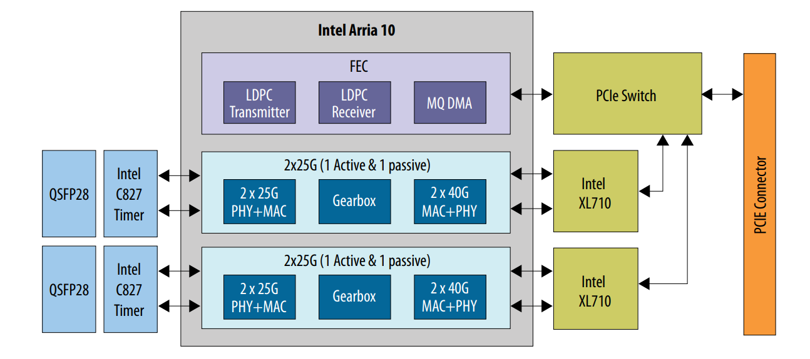
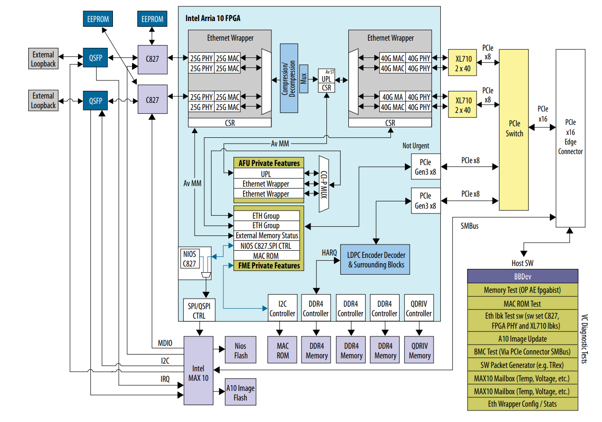
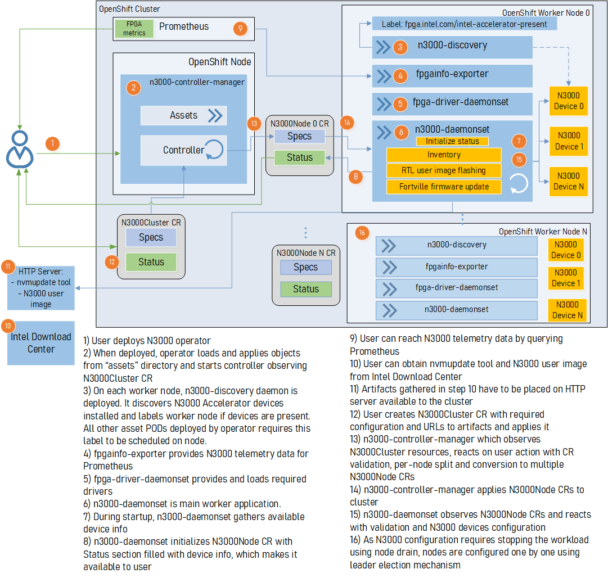
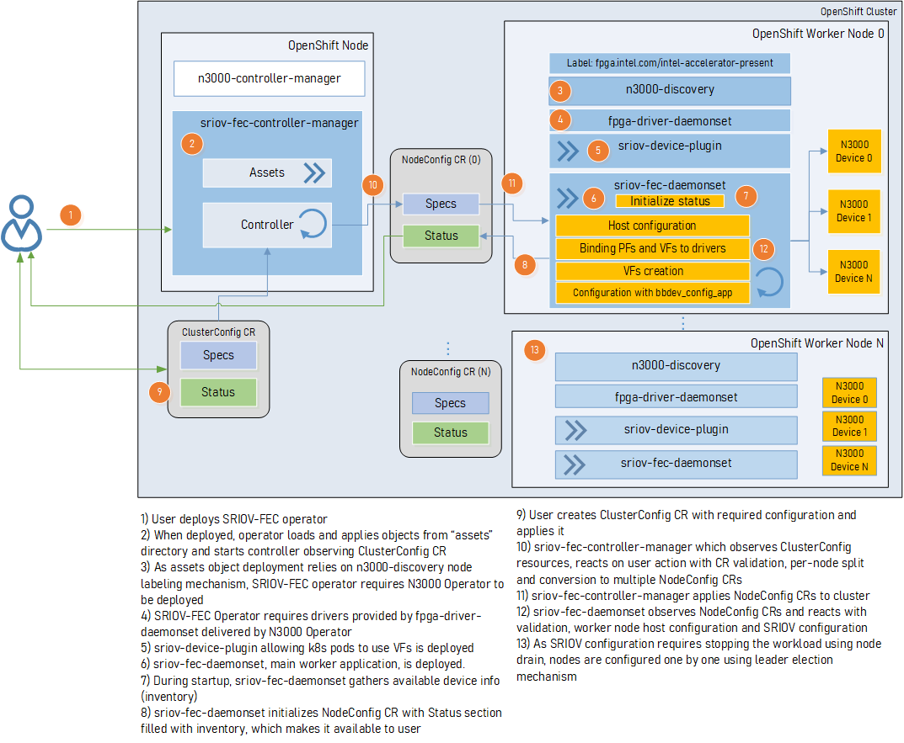

```text
SPDX-License-Identifier: Apache-2.0
Copyright (c) 2020 Intel Corporation
```
<!-- omit in toc -->
# OpenNESS Operator for Intel® FPGA PAC N3000

- [Overview](#overview)
- [Intel® PAC N3000 for vRAN Acceleration](#intel-pac-n3000-for-vran-acceleration)
- [Enabling 5G Wireless Acceleration in FlexRAN](#enabling-5g-wireless-acceleration-in-flexran)
- [OpenNESS Operator for Intel® FPGA PAC N3000](#openness-operator-for-intel-fpga-pac-n3000)
  - [N3000 Operator](#n3000-operator)
    - [Telemetry](#telemetry)
    - [Driver Container](#driver-container)
    - [N3000 Daemon](#n3000-daemon)
      - [OPAE RTL Update](#opae-rtl-update)
      - [NVM Update](#nvm-update)
  - [SRIOV FEC Operator](#sriov-fec-operator)
    - [FEC Configuration](#fec-configuration)
    - [SRIOV Device Plugin](#sriov-device-plugin)
- [Managing NIC Devices](#managing-nic-devices)
- [Technical Requirements and Dependencies](#technical-requirements-and-dependencies)
- [Deploying the Operator](#deploying-the-operator)
  - [Install the Bundle](#install-the-bundle)
  - [Applying Custom Resources](#applying-custom-resources)
- [Hardware Validation Environment](#hardware-validation-environment)
- [Summary](#summary)
- [Appendix 1 - Developer Notes](#appendix-1---developer-notes)
  - [Uninstalling Previously Installed Operator](#uninstalling-previously-installed-operator)
  - [Setting Up Operator Registry Locally](#setting-up-operator-registry-locally)

## Overview

This document details the support of Intel® FPGA Programmable Acceleration Card (Intel® FPGA PAC N3000) in Red Hat's OpenShift Container Platform, using Special Resource Operator framework based on Operator SDK project.
## Intel® PAC N3000 for vRAN Acceleration

The Intel® FPGA PAC N3000 plays a key role in accelerating certain types of workloads, which in turn increases the overall compute capacity of a commercial, off-the-shelf platform. FPGA benefits include:

* Flexibility - FPGA functionality can change upon every power up of the device.
* Acceleration - Get products to market faster and increase your system performance.
* Integration - Modern FPGAs include on-die processors, transceiver I/Os at 28 Gbps (or faster), RAM blocks, DSP engines, and more.
* Total Cost of Ownership (TCO) - While ASICs may cost less per unit than an equivalent FPGA, building them requires a non-recurring expense (NRE), expensive software tools, specialized design teams, and long manufacturing cycles.

The deployment of AI and machine learning (ML) applications at the edge is increasing the adoption of FPGA acceleration. This trend of devices performing machine learning at the edge locally versus relying solely on the cloud is driven by the need to lower latency, persistent availability, lower costs, and address privacy concerns.

The Intel® FPGA PAC N3000 is used as a reference FPGA and uses LTE/5G Forward Error Correction (FEC) as an example workload that accelerates the 5G or 4G L1 base station network function. The same concept and mechanism is applicable for application acceleration workloads like AI and ML on FPGA for Inference applications.

The Intel® FPGA PAC N3000 is a full-duplex, 100 Gbps in-system, re-programmable acceleration card for multi-workload networking application acceleration. It has an optimal memory mixture designed for network functions, with an integrated network interface card (NIC) in a small form factor that enables high throughput, low latency, and low power per bit for a custom networking pipeline.

This card can be used in conjunction with a [Intel® FlexRAN](https://software.intel.com/content/www/us/en/develop/videos/how-radio-access-network-is-being-virtualized-and-the-role-of-flexran.html?wapkw=FlexRAN) project. FlexRAN is a reference layer 1 pipeline of 4G eNb and 5G gNb on Intel® architecture. The FlexRAN reference pipeline consists of an L1 pipeline, optimized L1 processing modules, BBU pooling framework, cloud and cloud-native deployment support, and accelerator support for hardware offload. Intel® FPGA PAC N3000 card is used by FlexRAN to offload FEC (Forward Error Correction) for 4G and 5G as well as IO for fronthaul and midhaul.

> Note: User needs to have Intel® FlexRAN licence before downloading the required package from [Intel RDC](https://www.intel.com/content/www/us/en/design/resource-design-center.html)

The Intel® FPGA PAC N3000 card used in the FlexRAN solution exposes the following physical functions to the CPU host:

* 2x25G Ethernet* interface that can be used for Fronthaul or Midhaul
* One FEC interface that can be used of 4G or 5G FEC acceleration
* The LTE FEC IP components have turbo encoder/turbo decoder and rate matching/de-matching
* The 5GNR FEC IP components have low-density parity-check (LDPC) Encoder / LDPC Decoder, rate matching/de-matching, and UL HARQ combining
* Interface for managing and updating the FPGA Image – Remote System Update (RSU)


## Enabling 5G Wireless Acceleration in FlexRAN

The 5G Wireless Acceleration reference design provides IP (Intel® FPGA IP and software drivers) to support fronthaul IO and 5G channel coding, forward error correction(FEC). The Intel® FPGA PAC N3000 provides an on-board PCIe* switch that connects fronthaul and 5G channel coding functions to a PCIe* Gen3x16 edge connector. The Intel® FPGA PAC N3000 is a general-purpose acceleration card for networking.



## OpenNESS Operator for Intel® FPGA PAC N3000

The role of the operator for the Intel® FPGA PAC N3000 card is to orchestrate and manage the resources/devices exposed by the card within the OpenShift cluster. The operator is a state machine which will configure the resources and then monitor them and act autonomously based on the user interaction.
The operator design for PACN3000 is a bundle operator consisting of two distinct operators. One of the operators is the Intel® FPGA PAC N3000 operator, the other is the SRIOV FEC operator.

### N3000 Operator
N3000 operator handles the management of the FPGA configuration. It provides functionality to load the necessary drivers, allows the user to program the Intel® FPGA PAC N3000 user image and to update the firmware of the Intel® XL710 NICs (Network Interface Cards). It also deploys an instance of Prometheus exporter which collects metrics from the Intel® FPGA PAC N3000 card. The user interacts with the operator by providing a CR (Custom Resource), the operator constantly monitors the state of the CR to detect any changes and acts based on the changes detected. The CR is provided per cluster configuration, the components for individual nodes can be configured by specifying appropriate values for each component per "nodeName". The operator attempts to download the FPGA user image and the XL710 firmware from a location specified in the CR, the user is responsible for providing a HTTP server from which the files can be downloaded. The user is also responsible for provision of the PCI address of the RSU interface from Intel® FPGA PAC N3000 used to program the FPGA's user image, as well as MAC addresses of the XL710 NICs to be updated with new firmware. The user does not have to program both the FPGA and the XL710 component at the same time.

For more details, refer to:
- Intel® FPGA PAC N3000 5G User image - [AN 907: Enabling 5G Wireless Acceleration in FlexRAN: for the Intel® FPGA Programmable Acceleration Card N3000](https://www.intel.com/content/www/us/en/programmable/documentation/ocl1575542673666.html)
- Intel PAC N3000 Data Sheet - [Intel FPGA Programmable Acceleration Card N3000 Data Sheet](https://www.intel.com/content/dam/www/programmable/us/en/pdfs/literature/ds/ds-pac-n3000.pdf)



An example CR for the PACN3000 operator may appear as below:

```yaml
apiVersion: fpga.intel.com/v1
kind: N3000Cluster
metadata:
  name: n3000
  namespace: n3000-operator-resources
spec:
  nodes:
    - nodeName: node1.png.intel.com
      fpga:
        - userImageURL: http://10.10.10.122:8000/pkg/sr_vista_rot_2x2x25-v1.3.16.bin
          PCIAddr: 0000:1b:00.0
              checksum: "0b0a87b974d35ea16023ceb57f7d5d9c"
      fortville:
        firmwareURL: http://10.10.10.122:8000/7.00/700Series_NVMDowngradePackage_v7_00_Linux.tar.gz
            checksum: "0b0a87b974d35ea16023ceb57f7d5d9c"
        MACs:
          - MAC: 64:4c:36:12:61:d9
    - nodeName: node2.png.intel.com
      fpga:
        - userImageURL: http://10.10.10.122:8000/pkg/sr_vista_rot_2x2x25-v1.3.16.bin
          PCIAddr: 0000:1b:00.0
              checksum: "0b0a87b974d35ea16023ceb57f7d5d9c"
    - nodeName: node3.png.intel.com
      fortville:
        firmwareURL: http://10.10.10.122:8000/7.00/700Series_NVMDowngradePackage_v7_00_Linux.tar.gz
            checksum: "0b0a87b974d35ea16023ceb57f7d5d9c"
        MACs:
          - MAC: 64:4c:36:12:61:d3
```

The workflow of the N3000 operator is demonstrated in the following diagram: 


#### Telemetry

During the deployment of the N3000 operator a Prometheus exporter is deployed on each node. This exporter is responsible for gathering Intel® FPGA PAC N3000 telemetry such as temperature, voltage, power consumption etc. The statistics are collected using the (Open Programmable Acceleration Engine) OPAE's 'fpgainfo' tool and can be scraped by a Prometheus instance.

#### Driver Container

The driver container contains pre-build OPAE drivers built for a specific version of the node's kernel. This container is deployed as a DaemonSet on each applicable node; on deployment it mounts the required drivers onto the nodes filesystem and once it has finished executing its purpose, it sleeps indefinitely.

#### N3000 Daemon

The N3000 Daemon is part of the operator, it is a DaemonSet deployed on each applicable node, it is a reconcile loop which monitors the changes in each node's CR and acts on the changes. The logic implemented into this Daemon takes care of updating the cards' FPGA user image and NIC firmware, it is also responsible for draining the nodes and taking them out of commission when required by the update.

##### OPAE RTL Update

Once the operator/daemon detects a change to a CR related to the update of the FPGA user image, it tries to perform an update. It checks whether the card is already programmed with the current image, and accordingly either continue with an update and take the node out of commission, if required, or report back to the user that the image version loaded is up to date. The user image file with the program for the FPGA is expected to be provided by the user, the user is also responsible to sign the user image with SSL key or un-sign the image accordingly, please see [OPE Documentation for more details](https://www.intel.com/content/www/us/en/programmable/documentation/pei1570494724826.html). The user is required to place the user image file on an accessible HTTP server and provide an URL for it in the CR. If the file is provided correctly and the image is to be updated, the N3000 Daemon will update the FPGA user image using the OPAE tools provided in its Docker image and reset the PCI device. The update of the FPGA user image may take up to approximately 40 minutes per card. For programming cards on multiple nodes, the programming will happen only one node at a time.

As an example for the vRAN use-case, the card is to be programmed with an FEC (Forward Error Correction) image for either Turbo (4G) or LDPC (5G) - [see the product table](https://www.intel.com/content/www/us/en/programmable/products/boards_and_kits/dev-kits/altera/intel-fpga-pac-n3000/overview.html). Before the card is programmed with a new user image, it is expected that on the node the user will find the following interfaces belonging to the card (where Device ID '0b30' is the RSU interface used to program the card, and the '0b32' is a sample functional device):

```shell
[root@node1 /home]# lspci | grep accelerators
1b:00.0 Processing accelerators: Intel Corporation Device 0b30
1f:00.0 Processing accelerators: Intel Corporation Device 0b32
```
After the deployment of the operator, provision of appropriate user image (ie. 5G FEC image - '2x2x25G-5GLDPC-v1.6.1-3.0.0-unsigned.bin' used in this example) and a creation of the CR the N3000 daemon starts programming the image, the logs looking similar to the below output are expected to be available from the N3000 daemon's pod:
```shell
[2020-12-07 15:01:31,413] [WARNING ] Update starting. Please do not interrupt.
[2020-12-07 15:01:31,423] [INFO    ] updating from file /root/images/20ww27.5-2x2x25G-5GLDPC-v1.6.1-3.0.0_unsigned.bin with size 45089792
[2020-12-07 15:01:31,719] [INFO    ] writing to staging area
(  1%) [                    ] [454656/45089792 bytes][Time:0:01:34.729329]
(  2%) [                    ] [905216/45089792 bytes][Time:0:01:46.282628]
( 21%) [████                ] [9469952/45089792 bytes][Time:0:05:28.054406]
( 47%) [█████████           ] [21192704/45089792 bytes][Time:0:10:29.698702]
( 71%) [██████████████      ] [32014336/45089792 bytes][Time:0:15:09.879488]
( 85%) [█████████████████   ] [38330368/45089792 bytes][Time:0:17:51.414772]
( 99%) [███████████████████ ] [44642304/45089792 bytes][Time:0:20:34.695340]
(100%) [████████████████████] [45089792/45089792 bytes][Time:0:20:45.934285]

[2020-12-07 15:22:18,042] [INFO    ] applying update
(  1%) [                    ][Time:0:00:19.059557]
(  7%) [█                   ][Time:0:02:11.267586]
( 34%) [██████              ][Time:0:10:35.827041]
( 53%) [██████████          ][Time:0:16:30.666419]
( 59%) [███████████         ][Time:0:18:22.904335]
(100%) [████████████████████][Time:0:18:38.933257]

[2020-12-07 15:40:56,976] [INFO    ] Secure update OK
[2020-12-07 15:40:56,976] [INFO    ] Total time: 0:39:25.562393
2020-12-07 15:40:57,555 - [[pci_address(0000:1b:00.0), pci_id(0x8086, 0x0b30)]] performing RSU operation
2020-12-07 15:40:57,559 - [[pci_address(0000:17:00.0), pci_id(0x8086, 0x2030)]] removing device from PCIe bus
2020-12-07 15:40:57,559 - waiting 10 seconds for boot
2020-12-07 15:41:07,569 - rescanning PCIe bus: /sys/devices/pci0000:17/pci_bus/0000:17
2020-12-07 15:41:17,296 - RSU operation complete
```

Once the FPGA user image update is complete, the following devices belonging to the FPGA are reported, where Device ID '0b30' is the RSU interface used to program the card, and the '0b8f' is a PF (Physical Function) of the newly programmed FEC device. (Please note that the PCI address of the RSU interface will be re-numerated):

```shell
[root@node1 /home]# lspci | grep accelerators
1b:00.0 Processing accelerators: Intel Corporation Device 0b30
1f:00.0 Processing accelerators: Intel Corporation Device 0d8f (rev 01)
```

##### NVM Update

Once the operator/daemon detects a change to a CR related to the update of the Intel® XL710 firmware, it tries to perform an update. It checks whether the card is already programmed with the current firmware, and accordingly either continue with an update and take the node out of commission, if required, or report back to the user that the firmware version loaded is up to date. The firmware for the Intel® XL710 NICs is expected to be provided by the user, the user is also responsible that the firmware version is compatible with the device, please see [NVM utility link](https://downloadcenter.intel.com/download/24769/Non-Volatile-Memory-NVM-Update-Utility-for-Intel-Ethernet-Network-Adapter-700-Series). The user is required to place the firmware on an accessible HTTP server and provide an URL for it in the CR. If the file is provided correctly and the firmware is to be updated, the N3000 Daemon will update the Intel® XL710 NICs with the NVM utility provided.

As an example for the vRAN use-case with the card configured for the 2x2x25G mode - [see the brief](https://www.intel.com/content/www/us/en/programmable/products/boards_and_kits/dev-kits/altera/intel-fpga-pac-n3000/documentation.html). To find the NIC devices belonging to the Intel® FPGA PAC N3000 run:

```shell
[root@node1 /home]# lspci | grep XXV710
19:00.0 Ethernet controller: Intel Corporation Ethernet Controller XXV710 Intel(R) FPGA Programmable Acceleration Card N3000 for Networking (rev 02)
19:00.1 Ethernet controller: Intel Corporation Ethernet Controller XXV710 Intel(R) FPGA Programmable Acceleration Card N3000 for Networking (rev 02)
1d:00.0 Ethernet controller: Intel Corporation Ethernet Controller XXV710 Intel(R) FPGA Programmable Acceleration Card N3000 for Networking (rev 02)
1d:00.1 Ethernet controller: Intel Corporation Ethernet Controller XXV710 Intel(R) FPGA Programmable Acceleration Card N3000 for Networking (rev 02)
```

Before the NICs are programmed with the newer firmware, the configuration for each NIC interface may appear as below (see firmware-version):

```shell
[root@node1 /home]# ethtool -i ens785f0
driver: i40e
version: 2.8.20-k
firmware-version: 7.00 0x800052b0 0.0.0
expansion-rom-version:
bus-info: 0000:19:00.0
supports-statistics: yes
supports-test: yes
supports-eeprom-access: yes
supports-register-dump: yes
supports-priv-flags: yes
```

Once the NIC firmware update is complete, the firmware of the interface should reflect the change.

```shell
TODO
ATTACH INPUT FROOM ETHTOOL AFTER UPDATE
```

### SRIOV FEC Operator

The SRIOV FEC operator handles the management of the FEC devices used to accelerate the FEC process in vRAN L1 applications - the FEC devices are provided by Intel® FPGA PAC N3000 card programmed for the vRAN use-case. It provides functionality to create desired VFs (Virtual Functions) for the FEC device, bind them to appropriate drivers and configure the VF's queues for desired functionality in 4G or 5G deployment. It also deploys an instance of K8s SRIOV device plugin which manages the FEC VFs as an OpenShift cluster resource and configures this device plugin to detect the resources. The user interacts with the operator by providing a CR (Custom Resource), the operator constantly monitors the state of the CR to detect any changes and acts based on the changes detected. The CR is provided per cluster configuration, the components for individual nodes can be configured by specifying appropriate values for each component per "nodeName". Once the CR is applied or updated, the operator/daemon checks if the configuration is already applied, or it binds the PFs to driver, creates desired amount of VFs, binds them to driver and runs the pf-bb-config utility to configure the VF queues to the desired configuration.

An example CR for the SRIOV FEC operator may appear as below:

```yaml
apiVersion: sriovfec.intel.com/v1
kind: SriovFecClusterConfig
metadata:
  name: config
  namespace: n3000-operators-resources
spec:
  nodes:
    - nodeName: <NODE_NAME>
      physicalFunctions:
        - pciAddress: <CARD_PCI>
          pfDriver: pci-pf-stub
          vfDriver: vfio-pci
          vfAmount: 2
          bbDevConfig:
            n3000:
              # Network Type: either "FPGA_5GNR" or "FPGA_LTE"
              networkType: "FPGA_5GNR"
              # Programming mode: 0 = VF Programming, 1 = PF Programming
              pfMode: false
              flrTimeout: 610
              downlink:
                bandwidth: 3
                loadBalance: 128
                queues:
                  vf0: 16
                  vf1: 16
                  vf2: 0
                  vf3: 0
                  vf4: 0
                  vf5: 0
                  vf6: 0
                  vf7: 0
              uplink:
                bandwidth: 3
                loadBalance: 128
                queues:
                  vf0: 16
                  vf1: 16
                  vf2: 0
                  vf3: 0
                  vf4: 0
                  vf5: 0
                  vf6: 0
                  vf7: 0
```

The workflow of the SRIOV FEC operator is demonstrated in the following diagram:


#### FEC Configuration

The Intel® FPGA PAC N3000 correctly programmed with a vRAN image exposes a FEC PF device which is to be bound to PCI-PF-STUB driver in order to enable creation of the FEC VF devices. Once the FEC PF is bound to the correct driver, user can create up to 8 VF devices to be used in Cloud Native deployment of vRAN to accelerate FEC. Once these devices are created they are to be bound to a user-space driver such as VFIO-PCI in order for them to work and be consumed in vRAN application pods. Before the VF device is used by the application, the VF's encoding and decoding queues also need to be configured - this is done via pf-bb-config application with the input from the CR used as a configuration. Each FEC PF device provides a total of 64 queues to be configured, 32 queues for uplink and 32 queues for downlink, the queues would be typically distributed evenly across the VFs.

Before the deployment of the SRIOV FEC daemon, the user should expect following devices from the vRAN enabled Intel® FPGA PAC N3000 card, where Device ID '0b30' is the RSU interface used to program the card, and the '0b8f' is a PF (Physical Function) of the programmed FEC device:
```shell
[root@node1 /home]# lspci | grep accelerators
1b:00.0 Processing accelerators: Intel Corporation Device 0b30
1f:00.0 Processing accelerators: Intel Corporation Device 0d8f (rev 01)
```

After the deployment and application of the relevant CR, the created devices should appear similar to the following output (where Device ID '0b30' is the RSU interface used to program the card, the '0b8f' is a PF of the programmed FEC device and the '0d90' is a VF of the FEC device):

```shell
[root@node1 /home]# lspci | grep accelerators
1b:00.0 Processing accelerators: Intel Corporation Device 0b30
1f:00.0 Processing accelerators: Intel Corporation Device 0d8f (rev 01)
1f:00.1 Processing accelerators: Intel Corporation Device 0d90 (rev 01)
1f:00.2 Processing accelerators: Intel Corporation Device 0d90 (rev 01)
[root@node1 /home]#
[root@node1 /home#
[root@node1 /home## lspci -s 1f:00.0 -v
1f:00.0 Processing accelerators: Intel Corporation Device 0d8f (rev 01)
        Subsystem: Intel Corporation Device 0001
        Flags: bus master, fast devsel, latency 0, IRQ 10, NUMA node 0
        Memory at 387fffc11000 (64-bit, prefetchable) [size=4K]
        Memory at 387fffc10000 (64-bit, prefetchable) [size=4K]
        Capabilities: [68] MSI-X: Enable- Count=64 Masked-
        Capabilities: [78] Power Management version 3
        Capabilities: [80] Express Endpoint, MSI 00
        Capabilities: [100] Advanced Error Reporting
        Capabilities: [160] Alternative Routing-ID Interpretation (ARI)
        Capabilities: [200] Single Root I/O Virtualization (SR-IOV)
        Capabilities: [280] Secondary PCI Express
        Kernel driver in use: pci-pf-stub

[root@node1 /home]# lspci -s 1f:00.2 -v
1f:00.2 Processing accelerators: Intel Corporation Device 0d90 (rev 01)
        Subsystem: Intel Corporation Device e001
        Flags: fast devsel, NUMA node 0
        Memory at 387fffc09000 (64-bit, prefetchable) [virtual] [size=4K]
        Memory at 387fffc01000 (64-bit, prefetchable) [virtual] [size=4K]
        Capabilities: [40] Express Endpoint, MSI 00
        Capabilities: [7c] MSI-X: Enable- Count=64 Masked-
        Capabilities: [100] Alternative Routing-ID Interpretation (ARI)
        Kernel driver in use: vfio-pci
```

From SRIOV FEC daemon's pod, user should see in the logs similar to this, for successfully programmed VF queues:
```shell
FEC FPGA RTL v3.0
UL.DL Weights = 3.3
UL.DL Load Balance = 128.128
Queue-PF/VF Mapping Table = READY
Ring Descriptor Size = 256 bytes

--------+-----+-----+-----+-----+-----+-----+-----+-----+-----+
        |  PF | VF0 | VF1 | VF2 | VF3 | VF4 | VF5 | VF6 | VF7 |
--------+-----+-----+-----+-----+-----+-----+-----+-----+-----+
UL-Q'00 |     |  X  |     |     |     |     |     |     |     |
UL-Q'01 |     |  X  |     |     |     |     |     |     |     |
UL-Q'02 |     |  X  |     |     |     |     |     |     |     |
UL-Q'03 |     |  X  |     |     |     |     |     |     |     |
UL-Q'04 |     |  X  |     |     |     |     |     |     |     |
UL-Q'05 |     |  X  |     |     |     |     |     |     |     |
UL-Q'06 |     |  X  |     |     |     |     |     |     |     |
UL-Q'07 |     |  X  |     |     |     |     |     |     |     |
UL-Q'08 |     |  X  |     |     |     |     |     |     |     |
UL-Q'09 |     |  X  |     |     |     |     |     |     |     |
UL-Q'10 |     |  X  |     |     |     |     |     |     |     |
UL-Q'11 |     |  X  |     |     |     |     |     |     |     |
UL-Q'12 |     |  X  |     |     |     |     |     |     |     |
UL-Q'13 |     |  X  |     |     |     |     |     |     |     |
UL-Q'14 |     |  X  |     |     |     |     |     |     |     |
UL-Q'15 |     |  X  |     |     |     |     |     |     |     |
UL-Q'16 |     |     |  X  |     |     |     |     |     |     |
UL-Q'17 |     |     |  X  |     |     |     |     |     |     |
UL-Q'18 |     |     |  X  |     |     |     |     |     |     |
UL-Q'19 |     |     |  X  |     |     |     |     |     |     |
UL-Q'20 |     |     |  X  |     |     |     |     |     |     |
UL-Q'21 |     |     |  X  |     |     |     |     |     |     |
UL-Q'22 |     |     |  X  |     |     |     |     |     |     |
UL-Q'23 |     |     |  X  |     |     |     |     |     |     |
UL-Q'24 |     |     |  X  |     |     |     |     |     |     |
UL-Q'25 |     |     |  X  |     |     |     |     |     |     |
UL-Q'26 |     |     |  X  |     |     |     |     |     |     |
UL-Q'27 |     |     |  X  |     |     |     |     |     |     |
UL-Q'28 |     |     |  X  |     |     |     |     |     |     |
UL-Q'29 |     |     |  X  |     |     |     |     |     |     |
UL-Q'30 |     |     |  X  |     |     |     |     |     |     |
UL-Q'31 |     |     |  X  |     |     |     |     |     |     |
DL-Q'32 |     |  X  |     |     |     |     |     |     |     |
DL-Q'33 |     |  X  |     |     |     |     |     |     |     |
DL-Q'34 |     |  X  |     |     |     |     |     |     |     |
DL-Q'35 |     |  X  |     |     |     |     |     |     |     |
DL-Q'36 |     |  X  |     |     |     |     |     |     |     |
DL-Q'37 |     |  X  |     |     |     |     |     |     |     |
DL-Q'38 |     |  X  |     |     |     |     |     |     |     |
DL-Q'39 |     |  X  |     |     |     |     |     |     |     |
DL-Q'40 |     |  X  |     |     |     |     |     |     |     |
DL-Q'41 |     |  X  |     |     |     |     |     |     |     |
DL-Q'42 |     |  X  |     |     |     |     |     |     |     |
DL-Q'43 |     |  X  |     |     |     |     |     |     |     |
DL-Q'44 |     |  X  |     |     |     |     |     |     |     |
DL-Q'45 |     |  X  |     |     |     |     |     |     |     |
DL-Q'46 |     |  X  |     |     |     |     |     |     |     |
DL-Q'47 |     |  X  |     |     |     |     |     |     |     |
DL-Q'48 |     |     |  X  |     |     |     |     |     |     |
DL-Q'49 |     |     |  X  |     |     |     |     |     |     |
DL-Q'50 |     |     |  X  |     |     |     |     |     |     |
DL-Q'51 |     |     |  X  |     |     |     |     |     |     |
DL-Q'52 |     |     |  X  |     |     |     |     |     |     |
DL-Q'53 |     |     |  X  |     |     |     |     |     |     |
DL-Q'54 |     |     |  X  |     |     |     |     |     |     |
DL-Q'55 |     |     |  X  |     |     |     |     |     |     |
DL-Q'56 |     |     |  X  |     |     |     |     |     |     |
DL-Q'57 |     |     |  X  |     |     |     |     |     |     |
DL-Q'58 |     |     |  X  |     |     |     |     |     |     |
DL-Q'59 |     |     |  X  |     |     |     |     |     |     |
DL-Q'60 |     |     |  X  |     |     |     |     |     |     |
DL-Q'61 |     |     |  X  |     |     |     |     |     |     |
DL-Q'62 |     |     |  X  |     |     |     |     |     |     |
DL-Q'63 |     |     |  X  |     |     |     |     |     |     |
--------+-----+-----+-----+-----+-----+-----+-----+-----+-----+

Mode of operation = VF-mode
FPGA_5GNR PF [0000:1f:00.0] configuration complete!

```

#### SRIOV Device Plugin

As part of the SRIOV FEC operator the K8s SRIOV Network Device plugin is being deployed. The plugin is configured to detect the FEC devices only and is being configured according to the CR. This deployment of the SRIOV Network Device plugin does not take care of non FEC devices, for more information, refer to the documentation for [SRIOV Network Device plugin](https://github.com/k8snetworkplumbingwg/sriov-network-device-plugin). After the deployment of the Operator and update/application of the CR, the user will be able to detect the FEC VFs as allocatable resources in OpenShift cluster, the output should be similar to this ('intel.com/intel_fec_5g' or 'intel.com/intel_fec_4g' devices):

```shell
[root@node1 /home]# oc get node <node_name> -o json | jq '.status.allocatable'
{
  "cpu": "95500m",
  "ephemeral-storage": "898540920981",
  "hugepages-1Gi": "0",
  "hugepages-2Mi": "0",
  "intel.com/intel_fec_5g": "2",
  "intel.com/intel_fec_lte": "0",
  "memory": "146994112Ki",
  "pods": "250"
}
```

Once the SRIOV operator takes care of setting up and configuring the device, user can test the device using a sample 'test-bbdev' application from the [DPDK project](https://github.com/DPDK/dpdk/tree/v20.11/app/test-bbdev). An example of a prepared sample application's docker image can be found in [Intel® OpenNESS' project github EdgeApps repo](https://github.com/otcshare/edgeapps/tree/master/applications/fpga-sample-app). OpenNESS is an edge computing software toolkit that enables highly optimized and performant edge platforms to on-board and manage applications and network functions with cloud-like agility across any type of network. For more information, go to [www.openness.org](https://www.openness.org).

With a sample image of the DPDK application, the following pod can be created, similar to the following file as an example:

```yaml
apiVersion: v1
kind: Pod
metadata:
  name: pod-bbdev-sample-app
spec:
  containers:
  - securityContext:
      privileged: false
      capabilities:
        add:
          - IPC_LOCK
          - SYS_NICE
    name: bbdev-sample-app
    image: bbdev-sample-app:1.0
    imagePullPolicy: Never
    command: [ "sudo", "/bin/bash", "-c", "--" ]
    args: [ "while true; do sleep 300000; done;" ]
    volumeMounts:
    - mountPath: /hugepages
      name: hugepage
    - name: class
      mountPath: /sys/devices
      readOnly: false
    resources:
      requests:
        #intel.com/intel_fec_lte: '1'
        intel.com/intel_fec_5g: '1'
        hugepages-2Mi: 512Mi
        memory: 512Mi
      limits:
        #intel.com/intel_fec_lte: '1'
        intel.com/intel_fec_5g: '1'
        hugepages-2Mi: 512Mi
        memory: 512Mi
  volumes:
  - name: hugepage
    emptyDir:
      medium: HugePages
  - hostPath:
      path: "/sys/devices"
    name: class
```

The pod consumes one of the FEC VF resources. Once the pod is created, user can detect the VF allocated to the pod by executing into pods terminal and running:

```shell
[root@ bbdev-sample-app /root]# printenv | grep INTEL
PCIDEVICE_INTEL_COM_INTEL_FEC_5G=0000:1f:00.1
```

With the PCI ID of the allocated FEC VF to the pod established, user will run the test-bbdev application to test the device:

```shell
[root@ bbdev-sample-app /root]# ./test-bbdev.py --testapp-path ./dpdk-test-bbdev -e="-w0000:1f:00.1 " -i  -c validation -v ldpc_dec_v7813.data

Executing: ../../build/app/dpdk-test-bbdev -w0000:1f:00.1 -- -n 32 -l 16 -c validation -i -v test_vectors/ldpc_dec_v7813.data -b 32
EAL: Detected 96 lcore(s)
EAL: Detected 2 NUMA nodes
Option -w, --pci-whitelist is deprecated, use -a, --allow option instead
EAL: Multi-process socket /var/run/dpdk/rte/mp_socket
EAL: Forcing IOVA as 'PA' because KNI module is loaded
EAL: Selected IOVA mode 'PA'
EAL: Probing VFIO support...
EAL: VFIO support initialized
EAL:   using IOMMU type 1 (Type 1)
EAL: Probe PCI driver: intel_fpga_5gnr_fec_vf (8086:d90) device: 0000:1d:00.2 (socket 0)
EAL: No legacy callbacks, legacy socket not created

===========================================================
Starting Test Suite : BBdev Validation Tests
Test vector file = test_vectors/ldpc_dec_v7813.data
+ ------------------------------------------------------- +
== test: validation
dev:0000:1f:00.1, burst size: 32, num ops: 32, op type: RTE_BBDEV_OP_LDPC_DEC
Operation latency:
        avg: 41308 cycles, 17.96 us
        min: 41308 cycles, 17.96 us
        max: 41308 cycles, 17.96 us
TestCase [ 0] : validation_tc passed
 + ~~~~~~~~~~~~~~~~~~~~~~~~~~~~~~~~~~~~~~~~~~~~~~~~~~~~~~ +
 + Test Suite Summary : BBdev Validation Tests
 + Tests Total :        1
 + Tests Skipped :      0
 + Tests Passed :       1
 + Tests Failed :       0
 + Tests Lasted :       9.7673 ms
 + ~~~~~~~~~~~~~~~~~~~~~~~~~~~~~~~~~~~~~~~~~~~~~~~~~~~~~~ +
```

## Managing NIC Devices

The management of the NIC SRIOV devices/resources in the OpenShift cluster is out of scope of this operator, the user is expected to deploy an operator/[SRIOV Network Device plugin](https://github.com/k8snetworkplumbingwg/sriov-network-device-plugin) which will handle the orchestration of SRIOV NIC VFs between pods.

## Technical Requirements and Dependencies

The PACN3000 Operator bundle has the following requirements:

- [Intel® FPGA PAC N3000 card](https://www.intel.com/content/www/us/en/programmable/products/boards_and_kits/dev-kits/altera/intel-fpga-pac-n3000/overview.html)
- vRAN RTL image for the Intel® FPGA PAC N3000 card
- NVM utility
- OpenShift
- RT Kernel (the OPEA Docker images are build for specific kernel version)

`TODO let the team fill in other requirements`

## Deploying the Operator

The operator for PACN3000 is a bundle of two operators, it is easily deployable from the OpenShift cluster via provision and application of the following YAML spec files:

### Install the Bundle

To install the PACN3000 operator bundle perform the following steps:

Create the namespace:

```shell
[root@node1 /home]# oc new-project n3000-operators-resources
```

Create an operator group and the subscriptions:

```shell
cat <<EOF | oc apply -f -
apiVersion: operators.coreos.com/v1
kind: OperatorGroup
metadata:
  name: n3000-operators
  namespace: n3000-operators-resources
spec:
  targetNamespaces:
    - n3000-operators-resources
EOF
```

```shell
cat <<EOF | oc apply -f -
apiVersion: operators.coreos.com/v1alpha1
kind: Subscription
metadata:
  name: n3000-subscription
  namespace: n3000-operators-resources 
spec:
  channel: alpha
  name: n3000
  source: intel-operators
  sourceNamespace: openshift-marketplace
EOF
```

```shell
cat <<EOF | oc apply -f -
apiVersion: operators.coreos.com/v1alpha1
kind: Subscription
metadata:
  name: sriov-fec-subscription
  namespace: n3000-operators-resources 
spec:
  channel: alpha
  name: sriov-fec
  source: intel-operators
  sourceNamespace: openshift-marketplace
EOF
```

Verify that the operators are installed and pods are running:

```shell
[root@node1 /home]# oc get csv -n n3000-operators-resources

NAME               DISPLAY                                        VERSION   REPLACES   PHASE
n3000.v1.0.0       Intel® FPGA PAC N3000 Operator                 1.0.0                Succeeded
sriov-fec.v1.0.0   SRIOV-FEC Operator for Intel® FPGA PAC N3000   1.0.0                Succeeded
```

```shell
[root@node1 /home]# oc get po -n n3000-operators-resources

NAME                                            READY   STATUS    RESTARTS   AGE                                                                              
fpga-driver-daemonset-pkc6m                     1/1     Running   0          43s                                                                              
fpga-driver-daemonset-zfgws                     1/1     Running   0          43s                                                                              
fpgainfo-exporter-gmsnk                         1/1     Running   0          44s                                                                              
fpgainfo-exporter-sxw72                         1/1     Running   0          44s                                                                              
n3000-controller-manager-6f6cfdbf6d-5sv5x       2/2     Running   0          52s                                                                              
n3000-daemonset-4lf7q                           1/1     Running   0          44s                                                                              
n3000-daemonset-8h8ft                           1/1     Running   0          44s                                                                              
n3000-discovery-4zx49                           1/1     Running   0          44s                                                                              
n3000-discovery-sq25x                           1/1     Running   0          44s                                                                              
n3000-discovery-zfg6g                           1/1     Running   0          44s                                                                              
sriov-device-plugin-hkq6f                       1/1     Running   0          35s                                                                              
sriov-device-plugin-tpr4b                       1/1     Running   0          35s                                                                              
sriov-fec-controller-manager-78488c4c65-cpknc   2/2     Running   0          44s                                                                              
sriov-fec-daemonset-7h8kb                       1/1     Running   0          35s                                                                              
sriov-fec-daemonset-xxkgm                       1/1     Running   0          35s
```

### Applying Custom Resources

Once the operator is succesfully deployed, the user interacts with it by creating CRs which will be interpreted by the operators, [for a sample CR see the following code]('TODO' Link to samples)

To apply a CR run:

```shell
[root@node1 /home]# oc apply -f <cr-name>
```

To view the status of current CR run:

```shell
[root@node1 /home]# oc get <cr-name> 
`TODO` team to provide command and sample output
```

`TODO` Team to add a short paragraph about monitoring CRs

## Hardware Validation Environment 
- Intel® FPGA PAC N3000-2 
- Intel® Xeon® CPU platfrom
## Summary

The PACN3000 bundle operator is a fully functional tool to manage the Intel® FPGA PAC N3000 card, and it's vRAN FEC resources, autonomously in a Cloud Native OpenShift environment based on the user input.
The operator handles all the necessary actions from programming/updating the FPGA to configuration and management of the resources within the OpenShift cluster.

## Appendix 1 - Developer Notes

### Uninstalling Previously Installed Operator

If the operator has been previously installed, user needs to perform the following steps to delete the operator deployment.

Use the following command to identify items to delete: 

```shell
[root@node1 /home]# oc get csv -n n3000-operators-resources

NAME               DISPLAY                                        VERSION   REPLACES   PHASE
n3000.v1.0.0       Intel® FPGA PAC N3000 Operator                 1.0.0                Succeeded
sriov-fec.v1.0.0   SRIOV-FEC Operator for Intel® FPGA PAC N3000   1.0.0                Succeeded
```
Then delete the items and the namespace:
```shell
[root@node1 /home]# oc delete csv n3000.v1.0.0 sriov-fec.v1.0.0
[root@node1 /home]# oc delete ns n3000-operators-resources
```

Prune old images on nodes' docker registries:

```shell
[root@node1 /home]# mapfile -t nodes < <( kubectl get nodes -l node-role.kubernetes.io/worker= -o jsonpath={​​.items[*].status.addresses[?\(@.type==\"InternalIP\"\)].address}​​ )
[root@node1 /home]# for n in ${​​nodes}​​; do ssh core@${​​n}​​ sudo crictl rmi --prune; done
```

### Setting Up Operator Registry Locally

If needed the user can set up a local registry for the operators images.

Prerequisite: Make sure that the images used by the operator are pushed to LOCAL_REGISTRY

```shell
[root@node1 /home]# KERNEL_VERSION=<VER> GOPRIVATE=github.com/otcshare ./build_images.sh -r ${LOCAL_REGISTRY} -t
```

`TODO` The operator-sdk command also has to be built and installed before bundle build attempt is made

```shell
TODO - to be filled in by the team
```

Build and upload the bundle:

```shell
[root@node1 /home]# cd N3000
[root@node1 /home]# N3000_IMAGE_REGISTRY=${LOCAL_REGISTRY} make bundle IMG=${LOCAL_REGISTRY}/n3000-operator:v1.0.0
[root@node1 /home]# podman build  -f bundle.Dockerfile -t n3000-operator-bundle:1.0.0 .
[root@node1 /home]# podman push n3000-operator-bundle:1.0.0 ${LOCAL_REGISTRY}/n3000-operator-bundle:1.0.0 --tls-verify=false
[root@node1 /home]# cd ../sriov-fec
[root@node1 /home]# N3000_IMAGE_REGISTRY=${LOCAL_REGISTRY} make bundle IMG=${LOCAL_REGISTRY}/sriov-fec-operator:v1.0.0
[root@node1 /home]# podman build  -f bundle.Dockerfile -t sriov-fec-operator-bundle:1.0.0 .
[root@node1 /home]# podman push sriov-fec-operator-bundle:1.0.0 ${LOCAL_REGISTRY}/sriov-fec-operator-bundle:1.0.0 --tls-verify=false
```

Install OPM (if not already installed):

```shell
[root@node1 /home]# RELEASE_VERSION=v1.15.2
[root@node1 /home]# curl -LO https://github.com/operator-framework/operator-registry/releases/download/${RELEASE_VERSION}/linux-amd64-opm
[root@node1 /home]# chmod +x linux-amd64-opm
[root@node1 /home]# sudo mkdir -p /usr/local/bin/
[root@node1 /home]# sudo cp linux-amd64-opm /usr/local/bin/opm
[root@node1 /home]# rm -f linux-amd64-opm
```

Create and push the index image:

```shell
[root@node1 /home]# opm index add --bundles ${LOCAL_REGISTRY}/n3000-operator-bundle:1.0.0,${LOCAL_REGISTRY}/sriov-fec-operator-bundle:1.0.0 --tag ${LOCAL_REGISTRY}/n3000-operators-index:1.0.0 --skip-tls
[root@node1 /home]# podman push ${LOCAL_REGISTRY}/n3000-operators-index:1.0.0 --tls-verify=false
```

Add index to the cluster by creating a CatalogSource:

```shell
cat <<EOF | oc apply -f -
apiVersion: operators.coreos.com/v1alpha1
kind: CatalogSource
metadata:
    name: intel-operators
    namespace: openshift-marketplace
spec:
    sourceType: grpc
    image: ${LOCAL_REGISTRY}/n3000-operators-index:1.0.0
    publisher: Intel
    displayName: N3000 operators(Local)
EOF
```

Wait for packagemanifest to be available: 

```shell
[root@node1 /home]# oc get packagemanifests n3000 sriov-fec

 NAME        CATALOG                  AGE
 n3000       N3000 operators(Local)   24s
 sriov-fec   N3000 operators(Local)   24s
```
