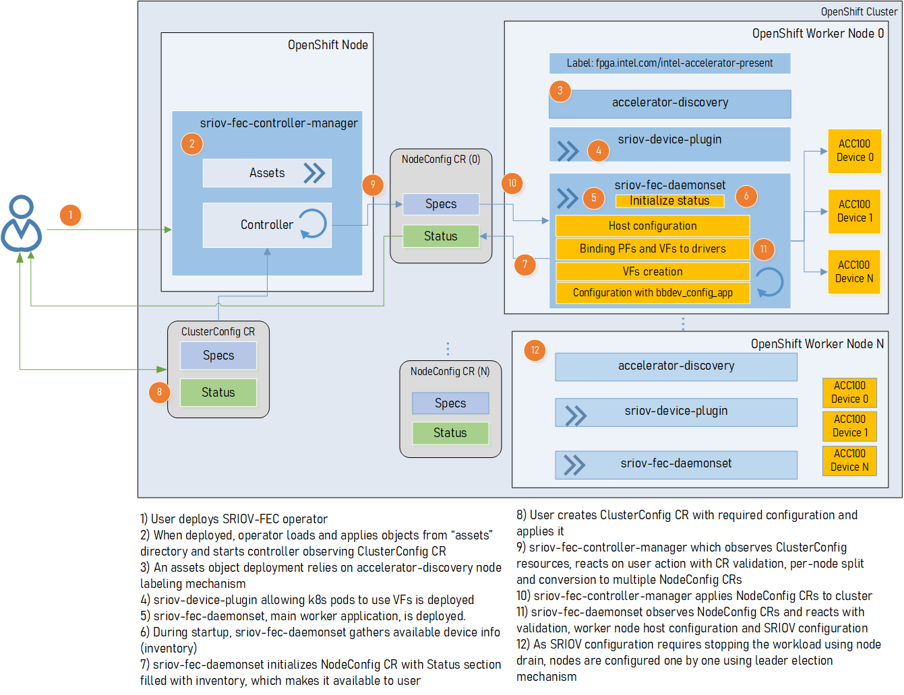
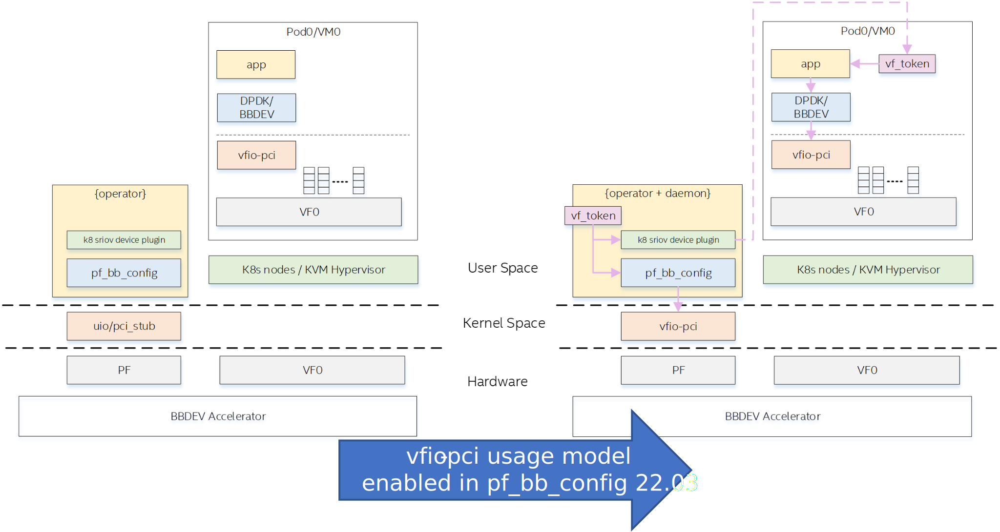
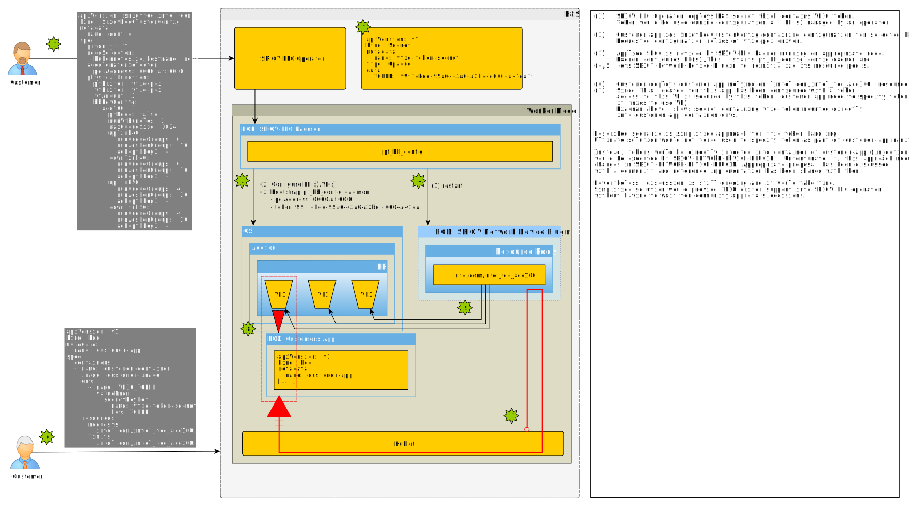

```text
SPDX-License-Identifier: Apache-2.0
Copyright (c) 2020-2022 Intel Corporation
```
<!-- omit in toc -->
# Smart Edge Open (SEO) Operator for Wireless FEC Accelerators

- [Overview](#overview)
- [SEO Operator for Wireless FEC Accelerators](#seo-operator-for-wireless-fec-accelerators)
  - [Wireless FEC Acceleration management](#wireless-fec-acceleration-management)
    - [FEC Configuration](#fec-configuration)
    - [SRIOV Device Plugin](#sriov-device-plugin)
- [Managing NIC Devices](#managing-nic-devices)
- [Secure boot](#secure-boot)
- [Deploying the Operator](#deploying-the-operator)
  - [Install dependencies](#install-dependencies)
  - [Install the Bundle](#install-the-bundle)
  - [Applying Custom Resources](#applying-custom-resources)
- [Telemetry](#telemetry)
- [Hardware Validation Environment](#hardware-validation-environment)
- [Summary](#summary)
- [Appendix 1 - Developer Notes](#appendix-1---developer-notes)
  - [Uninstalling Previously Installed Operator](#uninstalling-previously-installed-operator)
  - [Running operator on SNO](#running-operator-on-sno)
- [Appendix 2 - SEO Operator for Wireless FEC Accelerators Examples](#appendix-2---seo-operator-for-wireless-fec-accelerators-examples)
  - [ACC100 FEC](#acc100-fec)
    - [Sample CR for Wireless FEC (ACC100)](#sample-cr-for-wireless-fec-acc100)
    - [Sample Status for Wireless FEC (ACC100)](#sample-status-for-wireless-fec-acc100)
    - [Sample Daemon log for Wireless FEC (ACC100)](#sample-daemon-log-for-wireless-fec-acc100)
- [Appendix 3 - Gathering logs for bug report](#appendix-3---gathering-logs-for-bug-report)

## Overview

This document provides the instructions for using the SEO Operator for Wireless FEC Accelerators in Red Hat's OpenShift Container Platform and Kubernetes. This operator was developed with aid of the Operator SDK project.

## SEO Operator for Wireless FEC Accelerators

The role of the SEO Operator for Intel Wireless FEC Accelerator is to orchestrate and manage the resources/devices exposed by a range of Intel's vRAN FEC acceleration devices/hardware within the OpenShift or Kubernetes cluster. The operator is a state machine which will configure the resources and then monitor them and act autonomously based on the user interaction.
The operator design of the SEO Operator for Intel Wireless FEC Accelerator supports the following vRAN FEC accelerators:

* [Intel® vRAN Dedicated Accelerator ACC100](https://github.com/intel-collab/applications.orchestration.operators.sriov-fec-operator/blob/master/spec/vran-accelerators-supported-by-operator.md#intel-vran-dedicated-accelerator-acc100)

### Wireless FEC Acceleration management

This operator handles the management of the FEC devices used to accelerate the FEC process in vRAN L1 applications - the FEC devices are provided by a designated hardware (ie. Intel® vRAN Dedicated Accelerator ACC100).
It provides functionality to create desired VFs (Virtual Functions) for the FEC device, binds them to appropriate drivers and configures the VF's queues for desired functionality in 4G or 5G deployment. 
It also deploys an instance of the [SR-IOV Network Device Plugin](https://github.com/k8snetworkplumbingwg/sriov-network-device-plugin) which manages the FEC VFs as an OpenShift cluster resource and configures this device plugin to detect the resources. 
The user interacts with the operator by providing a CR (CustomResource). 
The operator constantly monitors the state of the CR to detect any changes and acts based on the changes detected. 
The CR is provided per cluster configuration. The components for individual nodes can be configured by specifying appropriate values for each component per "nodeSelector".
Once the CR is applied or updated, the operator/daemon checks if the configuration is already applied, and, if not it binds the PFs to driver, creates desired amount of VFs, binds them to driver and runs the [pf-bb-config utility](https://github.com/intel/pf-bb-config) to configure the VF queues to the desired configuration.

This operator is a common operator for FEC device/resource management for a range on accelerator cards. For specific examples of CRs dedicated to single accelerator card only see:

* [Sample CR for Wireless FEC (ACC100)](#sample-cr-for-wireless-fec-acc100)

The workflow of the SRIOV FEC operator is shown in the following diagram:


#### FEC Configuration

The Intel's vRAN FEC acceleration devices/hardware expose the FEC PF device which is to be bound to PCI-PF-STUB, ISB_UIO and VFIO-PCI in order to enable creation of the FEC VF devices. Once the FEC PF is bound to the correct driver, the user can create a number of devices to be used in Cloud Native deployment of vRAN to accelerate FEC. Once these devices are created they are to be bound to a user-space driver such as VFIO-PCI in order for them to work and be consumed in vRAN application pods. Before the device can be used by the application, the device needs to be configured - notably the mapping of queues exposed to the VFs - this is done via pf-bb-config application with the input from the CR used as a configuration.

> NOTE: For [Intel® vRAN Dedicated Accelerator ACC100](https://github.com/intel-collab/applications.orchestration.operators.sriov-fec-operator/blob/master/spec/vran-accelerators-supported-by-operator.md#intel-vran-dedicated-accelerator-acc100) it is advised to create all 16 VFs. The card is configured to provide up to 8 queue groups with up to 16 queues per group. The queue groups can be divided between groups allocated to 5G/4G and Uplink/Downlink, it can be configured for 4G or 5G only, or both 4G and 5G at the same time. Each configured VF has access to all the queues. Each of the queue groups has a distinct priority level. The request for given queue group is made from application level (ie. vRAN application leveraging the FEC device).

To get all the nodes containing one of the supported vRAN FEC accelerator devices run the following command (all the commands are run in the `vran-acceleration-operators` namespace, if operator is used on Kubernetes then use `kubectl` instead of `oc`):
```shell
[user@ctrl1 /home]# oc get sriovfecnodeconfig
NAME             CONFIGURED
node1            Succeeded
```

To find the PF of the SRIOV FEC accelerator device to be configured, run the following command:

```shell
[user@ctrl1 /home]# oc get sriovfecnodeconfig node1 -o yaml

***
status:
  conditions:
  - lastTransitionTime: "2021-03-19T17:19:37Z"
    message: Configured successfully
    observedGeneration: 1
    reason: ConfigurationSucceeded
    status: "True"
    type: Configured
  inventory:
    sriovAccelerators:
    - deviceID: 0d5c
      driver: ""
      maxVirtualFunctions: 16
      pciAddress: 0000:af:00.0
      vendorID: "8086"
      virtualFunctions: []
```

To configure the FEC device with desired setting create a CR (An example below configures ACC100's 8/8 queue groups for 5G, 4 queue groups for Uplink and another 4 queues groups for Downlink), for the list of CRs applicable to all supported devices see:

* [Sample CR for Wireless FEC (ACC100)](#sample-cr-for-wireless-fec-acc100)

```yaml
apiVersion: sriovfec.intel.com/v2
kind: SriovFecClusterConfig
metadata:
  name: config
spec:
  priority: 1
  nodeSelector:
    kubernetes.io/hostname: node1
  acceleratorSelector:
    pciAddress: 0000:af:00.0    
  physicalFunction:
    pfDriver: "pci-pf-stub"
    vfDriver: "vfio-pci"
    vfAmount: 16
    bbDevConfig:
      acc100:
        # Programming mode: 0 = VF Programming, 1 = PF Programming
        pfMode: false
        numVfBundles: 16
        maxQueueSize: 1024
        uplink4G:
          numQueueGroups: 0
          numAqsPerGroups: 16
          aqDepthLog2: 4
        downlink4G:
          numQueueGroups: 0
          numAqsPerGroups: 16
          aqDepthLog2: 4
        uplink5G:
          numQueueGroups: 4
          numAqsPerGroups: 16
          aqDepthLog2: 4
        downlink5G:
          numQueueGroups: 4
          numAqsPerGroups: 16
          aqDepthLog2: 4
```

To apply the CR run:

```shell
[user@ctrl1 /home]# oc apply -f <sriovfec_cr_name>.yaml
```

After creation of the CR, the SRIOV FEC daemon starts configuring the FEC device. Once the SRIOV FEC configuration is complete, the following status is reported:

```shell
[user@ctrl1 /home]# oc get sriovfecnodeconfig
NAME             CONFIGURED
node1            Succeeded
```

From SRIOV FEC daemon pod, the user should see logs similar to the output below, if the VF queues were successfully programmed. For a list of sample log outputs for applicable devices see:

* [Sample Daemon log for Wireless FEC (ACC100)](#sample-daemon-log-for-wireless-fec-acc100)

```shell
[user@ctrl1 /home]# oc get pod | grep sriov-fec-daemonset
sriov-fec-daemonset-h4jf8                      1/1     Running   0          19h

[user@ctrl1 /home]# oc logs sriov-fec-daemonset-h4jf8

***
{"level":"Level(-2)","ts":1616798129.251027,"logger":"daemon.drainhelper.cordonAndDrain()","msg":"node drained"}
{"level":"Level(-4)","ts":1616798129.2510319,"logger":"daemon.drainhelper.Run()","msg":"worker function - start"}
{"level":"Level(-4)","ts":1616798129.341839,"logger":"daemon.NodeConfigurator.applyConfig","msg":"current node status","inventory":{"sriovAccelerators":[{"vendorID":"8086","deviceID":"0b32","pciAddress":"0000:20:00.0","driver":"pci-pf-stub","maxVirtualFunctions":1,"virtualFunctions":[{"pciAddress":"0000:20:00.1","driver":"vfio-pci","deviceID":"0b33"}]},{"vendorID":"8086","deviceID":"0d5c","pciAddress":"0000:af:00.0","driver":"pci-pf-stub","maxVirtualFunctions":16,"virtualFunctions":[{"pciAddress":"0000:b0:00.0","driver":"vfio-pci","deviceID":"0d5d"},{"pciAddress":"0000:b0:00.1","driver":"vfio-pci","deviceID":"0d5d"},{"pciAddress":"0000:b0:00.2","driver":"vfio-pci","deviceID":"0d5d"},{"pciAddress":"0000:b0:00.3","driver":"vfio-pci","deviceID":"0d5d"}]}]}}
{"level":"Level(-4)","ts":1616798129.3419566,"logger":"daemon.NodeConfigurator.applyConfig","msg":"configuring PF","requestedConfig":{"pciAddress":"0000:20:00.0","pfDriver":"pci-pf-stub","vfDriver":"vfio-pci","vfAmount":1,"bbDevConfig":{"acc100":{"numVfBundles":1,"maxQueueSize":1024,"uplink4G":{"numQueueGroups":0,"numAqsPerGroups":16,"aqDepthLog2":4},"downlink4G":{"numQueueGroups":0,"numAqsPerGroups":16,"aqDepthLog2":4},"uplink5G":{"numQueueGroups":4,"numAqsPerGroups":16,"aqDepthLog2":4},"downlink5G":{"numQueueGroups":4,"numAqsPerGroups":16,"aqDepthLog2":4}}}}{"level":"Level(-4)","ts":1616798129.3419993,"logger":"daemon.NodeConfigurator.loadModule","msg":"executing command","cmd":"/usr/sbin/chroot /host/ modprobe pci-pf-stub"}
{"level":"Level(-4)","ts":1616798129.3458664,"logger":"daemon.NodeConfigurator.loadModule","msg":"commands output","output":""}
{"level":"Level(-4)","ts":1616798129.345896,"logger":"daemon.NodeConfigurator.loadModule","msg":"executing command","cmd":"/usr/sbin/chroot /host/ modprobe vfio-pci"}
{"level":"Level(-4)","ts":1616798129.3490586,"logger":"daemon.NodeConfigurator.loadModule","msg":"commands output","output":""}
{"level":"Level(-2)","ts":1616798130.3972273,"logger":"daemon.NodeConfigurator","msg":"device is bound to driver","path":"/sys/bus/pci/devices/0000:20:00.0/driver"}
```

The user can observe the change of the cards FEC configuration. The created devices should appear similar to the following output (The '0d5c' is a PF of the FEC device and the '0d5d' is a VF of the FEC device). For a list of sample status output for applicable devices see:

* [Sample Status for Wireless FEC (ACC100)](#sample-status-for-wireless-fec-acc100)

```yaml
[user@ctrl1 /home]# oc get sriovfecnodeconfig node1 -o yaml

***
status:
    conditions:
    - lastTransitionTime: "2021-03-19T11:46:22Z"
      message: Configured successfully
      observedGeneration: 1
      reason: Succeeded
      status: "True"
      type: Configured
    inventory:
      sriovAccelerators:
      - deviceID: 0d5c
        driver: pci-pf-stub
        maxVirtualFunctions: 16
        pciAddress: 0000:af:00.0
        vendorID: "8086"
        virtualFunctions:
        - deviceID: 0d5d
          driver: vfio-pci
          pciAddress: 0000:b0:00.0
        - deviceID: 0d5d
          driver: vfio-pci
          pciAddress: 0000:b0:00.1
        - deviceID: 0d5d
          driver: vfio-pci
          pciAddress: 0000:b0:00.2
        - deviceID: 0d5d
          driver: vfio-pci
          pciAddress: 0000:b0:00.3
        - deviceID: 0d5d
          driver: vfio-pci
          pciAddress: 0000:b0:00.4
```

#### SRIOV Device Plugin

As part of the SRIOV FEC operator the K8s SRIOV Network Device plugin is being deployed. The plugin is configured to detect the FEC devices only and is being configured according to the CR. This deployment of the SRIOV Network Device plugin does not manage non-FEC devices. For more information, refer to the documentation for [SRIOV Network Device plugin](https://github.com/openshift/sriov-network-device-plugin). After the deployment of the Operator and update/application of the CR, the user will be able to detect the FEC VFs as allocatable resources in the OpenShift cluster. The output should be similar to this (`intel.com/intel_fec_acc100` or alternative for a different FEC accelerator):

```shell
[user@node1 /home]# oc get node <node_name> -o json | jq '.status.allocatable'
{
  "cpu": "95500m",
  "ephemeral-storage": "898540920981",
  "hugepages-1Gi": "30Gi",
  "intel.com/intel_fec_acc100": "16",
  "memory": "115600160Ki",
  "pods": "250"
}
```

Once the SRIOV operator takes care of setting up and configuring the device, user can test the device using a sample 'test-bbdev' application from the [DPDK project (DPDK 20.11)](https://github.com/DPDK/dpdk/tree/v20.11/app/test-bbdev). An example of a prepared sample application's docker image can be found in [Intel® SEO project github EdgeApps repo](https://github.com/smart-edge-open/edgeapps/tree/master/applications/fpga-sample-app). SEO is an edge computing software toolkit that enables highly optimized and performant edge platforms to on-board and manage applications and network functions with cloud-like agility across any type of network. For more information, go to [www.smart-edge-open.github.io](https://smart-edge-open.github.io/).

With a sample image of the DPDK application, the following pod can be created similar to the following file as an example (`intel.com/intel_fec_acc100` needs to be replaced as needed when different accelerator is used):

```yaml
apiVersion: v1
kind: Pod
metadata:
  name: pod-bbdev-sample-app
spec:
  containers:
  - securityContext:
      privileged: false
      capabilities:
        add:
          - IPC_LOCK
          - SYS_NICE
    name: bbdev-sample-app
    image: bbdev-sample-app:1.0
    command: [ "sudo", "/bin/bash", "-c", "--" ]
    args: [ "while true; do sleep 300000; done;" ]
    volumeMounts:
    - mountPath: /hugepages
      name: hugepage
    - name: class
      mountPath: /sys/devices
      readOnly: false
    resources:
      requests:
        intel.com/intel_fec_acc100: '1'
        hugepages-1Gi: 2Gi
        memory: 2Gi
      limits:
        intel.com/intel_fec_acc100: '1'
        hugepages-1Gi: 2Gi
        memory: 2Gi
  volumes:
  - name: hugepage
    emptyDir:
      medium: HugePages
  - hostPath:
      path: "/sys/devices"
    name: class
```

The pod consumes one of the FEC VF resources. Once the pod is created, user can detect the VF allocated to the pod by executing into pods terminal and running:

```shell
[user@ bbdev-sample-app /root]# printenv | grep INTEL_FEC
PCIDEVICE_INTEL_COM_INTEL_FEC_ACC100=0000:b0:00.0
```

With the PCIe B:D.F of the FEC VF allocated to the pod established, user will run the 'test-bbdev' application to test the device (similar output indicating that the tests are passing is expected):

```shell
[user@ bbdev-sample-app /root]# ./test-bbdev.py --testapp-path ./dpdk-test-bbdev -e="-w ${PCIDEVICE_INTEL_COM_INTEL_FEC_ACC100}" -i -n 1 -b 1 -l 1 -c validation -v ldpc_dec_v7813.data

Executing: ./dpdk-test-bbdev -w 0000:b0:00.0 -- -n 1 -l 1 -c validation -i -v ldpc_dec_v7813.data -b 1
EAL: Detected 96 lcore(s)
EAL: Detected 2 NUMA nodes
Option -w, --pci-whitelist is deprecated, use -a, --allow option instead
EAL: Multi-process socket /var/run/dpdk/rte/mp_socket
EAL: Selected IOVA mode 'VA'
EAL: Probing VFIO support...
EAL: VFIO support initialized
EAL:   using IOMMU type 1 (Type 1)
EAL: Probe PCI driver: intel_acc100_vf (8086:d5d) device: 0000:b0:00.0 (socket 1)
EAL: No legacy callbacks, legacy socket not created

 

===========================================================
Starting Test Suite : BBdev Validation Tests
Test vector file = ldpc_dec_v7813.data
Device 0 queue 16 setup failed
Allocated all queues (id=16) at prio0 on dev0
Device 0 queue 32 setup failed
Allocated all queues (id=32) at prio1 on dev0
Device 0 queue 48 setup failed
Allocated all queues (id=48) at prio2 on dev0
Device 0 queue 64 setup failed
Allocated all queues (id=64) at prio3 on dev0
Device 0 queue 64 setup failed
All queues on dev 0 allocated: 64
+ ------------------------------------------------------- +
== test: validation
dev:0000:b0:00.0, burst size: 1, num ops: 1, op type: RTE_BBDEV_OP_LDPC_DEC
Operation latency:
        avg: 23092 cycles, 10.0838 us
        min: 23092 cycles, 10.0838 us
        max: 23092 cycles, 10.0838 us
TestCase [ 0] : validation_tc passed
 + ~~~~~~~~~~~~~~~~~~~~~~~~~~~~~~~~~~~~~~~~~~~~~~~~~~~~~~ +
 + Test Suite Summary : BBdev Validation Tests
 + Tests Total :        1
 + Tests Skipped :      0
 + Tests Passed :       1
 + Tests Failed :       0
 + Tests Lasted :       177.67 ms
 + ~~~~~~~~~~~~~~~~~~~~~~~~~~~~~~~~~~~~~~~~~~~~~~~~~~~~~~ +
```

## Managing NIC Devices

The management of the NIC SRIOV devices/resources in the OpenShift cluster is out of scope of this operator. The user is expected to deploy an operator/[SRIOV Network Device plugin](https://github.com/openshift/sriov-network-device-plugin) which will handle the orchestration of SRIOV NIC VFs between pods.

## Secure Boot

Until SRIOV-FEC operator 2.3.0, `pf-bb-config` application which comes as part of SRIOV-FEC operator distribution, 
relied on MMIO access to the PF of the ACC100 (access through mmap of the PF PCIe BAR config space using igb_uio and/or pf_pci_stub drivers).

In case of enabled secure boot, this access is blocked by kernel through a feature called [lockdown](https://man7.org/linux/man-pages/man7/kernel_lockdown.7.html).
Lockdown mode automatically prevents relying on igb_uio and/or pf_pci_stub drivers due to the direct mmap.
In other words: when secure boot is enabled, this legacy usage is not supported.

To be able to support this special mode, `pf_bb_config` application has been enhanced (v22.03) and now it could use more secure approach relying on vfio-pci.  

|  |
|------------------------------------------------------|

SRIOV-FEC operator 2.3.0 leverages enhancements provided by `pf_bb_config` and it provides support for vfio-pci driver. 
It means operator would work correctly on a platforms where secure boot is enabled.

'vfio-pci' driver support implemented in SRIOV-FEC operator 2.3.0 is visualized by diagram below:


|  |
|-------------------------------------------------------------------------------|

Previously supported drivers `pci-pf-stub` and `igb_uio` are still supported by an operator, but they cannot be used together with secure boot feature.

Please be aware that usage of `vfio-pci` driver requires following arguments added to the kernel:
 - vfio_pci.enable_sriov=1
 - vfio_pci.disable_idle_d3=1

If `vfio-pci` PF driver is used, then access to VF requires `UUID` token. Token is identical for all nodes in cluster, has default value of `02bddbbf-bbb0-4d79-886b-91bad3fbb510` and could be changed by
    setting `SRIOV_FEC_VFIO_TOKEN` in `subscription.spec.config.env` field. Applications that are using VFs should provide token via EAL parameters - e.g
    `./test-bbdev.py -e="--vfio-vf-token=02bddbbf-bbb0-4d79-886b-91bad3fbb510 -a0000:f7:00.1"`

## Deploying the Operator

The SEO Operator for Wireless FEC Accelerators is easily deployable from the OpenShift or Kubernetes cluster via provisioning and application of the following YAML spec files:

If operator is being installed on OpenShift, then follow [deployment steps for OpenShift](openshift-deployment.md).
Otherwise follow [steps for Kubernetes](kubernetes-deployment.md).

### Applying Custom Resources

Once the operator is successfully deployed, the user interacts with it by creating CRs which will be interpreted by the operators, for examples of CRs see the following section:
- [FEC Configuration](#fec-configuration)

To apply a CR run:

```shell
[user@ctrl1 /home]# oc apply -f <cr-name>
```

To view the status of current CR run (sample output):

```shell
[user@ctrl1 /home]# oc get sriovfecclusterconfig config -o yaml
***
spec:
  priority: 1
  nodeSelector:
    kubernetes.io/hostname: node1
  acceleratorSelector:
    pciAddress: 0000:af:00.0    
  physicalFunction:  
    bbDevConfig:
      acc100:
        downlink4G:
          aqDepthLog2: 4
          numAqsPerGroups: 16
          numQueueGroups: 0
        downlink5G:
          aqDepthLog2: 4
          numAqsPerGroups: 16
          numQueueGroups: 4
        maxQueueSize: 1024
        numVfBundles: 16
        pfMode: false
        uplink4G:
          aqDepthLog2: 4
          numAqsPerGroups: 16
          numQueueGroups: 0
        uplink5G:
          aqDepthLog2: 4
          numAqsPerGroups: 16
          numQueueGroups: 4
    pciAddress: 0000:af:00.0
    pfDriver: pci-pf-stub
    vfAmount: 16
    vfDriver: vfio-pci
status:
  syncStatus: Succeeded
```
### Telemetry
Operator exposes telemetry from pf-bb-config application for any supported card which uses `vfio-pci` PF driver in Prometheus format.
      It is available in `daemonset` container under `:8080/bbdevconfig` endpoint.
      By default endpoint updates metrics every 15 second, however this interval could be modified by
      changing value of `SRIOV_FEC_METRIC_GATHER_INTERVAL` env var in operators subscription.

There are 5 available metrics:
- Bytes_Processed_Per_VFs - represents number of bytes that are processed by VF
  - `Pci_Address` - represents unique BDF for VF
  - `Queue_Type` - represents queue type for VF. Available values: `5GDL`, `5GUL`, `FFT`
- Code_Blocks_Per_VFs - number of code blocks processed by VF
  - `Pci_Address` - represents unique BDF for VF
  - `Queue_Type` - represents queue type for VF. Available values: `5GDL`, `5GUL`, `FFT`
- Counters_Per_Engine - number of code blocks processed by Engine
  - `Engine_ID` - represents integer ID of engine on card
  - `Pci_Address` - represents unique BDF for card on which engine is located
  - `Queue_Type` - represents queue type for VF. Available values: `5GDL`, `5GUL`, `FFT`
- Vf_Count - describes number of configured VFs on card
  - `Pci_Address` - represents unique BDF for PF
  - `Status` - represents current status of SriovFecNodeConfig. Available values: `InProgress`, `Succeeded`, `Failed`, `Ignored`
- Vf_Status - equals to 1 if `Status` is `RTE_BBDEV_DEV_CONFIGURED` or `RTE_BBDEV_DEV_ACTIVE` and 0 otherwise
  - `Pci_Address` - represents unique BDF for VF
  - `Status` - represents status as exposed by pf-bb-config. Available values: `RTE_BBDEV_DEV_NOSTATUS`, `RTE_BBDEV_DEV_NOT_SUPPORTED`, `RTE_BBDEV_DEV_RESET`,
    `RTE_BBDEV_DEV_CONFIGURED`, `RTE_BBDEV_DEV_ACTIVE`, `RTE_BBDEV_DEV_FATAL_ERR`, `RTE_BBDEV_DEV_RESTART_REQ`, `RTE_BBDEV_DEV_RECONFIG_REQ`, `RTE_BBDEV_DEV_CORRECT_ERR`

If SriovFecNodeConfig for node is in `Succeeded` state, then all those metrics are exposed
```
Bytes_Processed_Per_VFs{Pci_Address="0000:cb:00.0",Queue_Type="5GUL"} 0
Bytes_Processed_Per_VFs{Pci_Address="0000:cb:00.0",Queue_Type="5GDL"} 0
Code_Blocks_Per_VFs{Pci_Address="0000:cb:00.0",Queue_Type="5GUL"} 0
Code_Blocks_Per_VFs{Pci_Address="0000:cb:00.0",Queue_Type="5GDL"} 0
Counters_Per_Engine{Engine_ID="0",Pci_Address="0000:ca:00.0",Queue_Type="5GUL"} 0
Vf_Count{Pci_Address="0000:ca:00.0",Status="Succeeded"} 1
Vf_Status{Pci_Address="0000:cb:00.0",Status="RTE_BBDEV_DEV_CONFIGURED"} 1
```
Otherwise only a `Vf_count` metric is exposed
```
Vf_Count{Pci_Address="0000:ca:00.0",Status="Failed"} 0
```

## Hardware Validation Environment

- Intel® vRAN Dedicated Accelerator ACC100
- 2nd Generation Intel® Xeon® processor platform

## Summary

The SEO Operator for Wireless FEC Accelerators is a fully functional tool to manage the vRAN FEC resources autonomously in a Cloud Native OpenShift environment based on the user input.
The operator handles all the necessary actions from creation of FEC resources to configuration and management of the resources within the OpenShift cluster.

## Appendix 1 - Developer Notes

### Uninstalling Previously Installed Operator

If the operator has been previously installed, the user needs to perform the following steps to delete the operator deployment.

Use the following command to identify items to delete:

```shell
[user@ctrl1 /home]# oc get csv -n vran-acceleration-operators

NAME               DISPLAY                                             VERSION   REPLACES   PHASE
sriov-fec.v2.2.0   SEO SR-IOV Operator for Wireless FEC Accelerators   2.2.0                Succeeded
```

Then delete the items and the namespace:

```shell
[user@ctrl1 /home]# oc delete csv sriov-fec.v2.2.0
[user@ctrl1 /home]# oc delete ns vran-acceleration-operators
```

### Running operator on SNO

If user needs to run operator on SNO (Single Node Openshift), then user should provide ClusterConfigs (which are described in following chapters) with `spec.drainSkip: true` to avoid node draining, because it is impossible to drain node if there's only 1 node.

## Appendix 2 - SEO Operator for Wireless FEC Accelerators Examples

### ACC100 FEC

#### Sample CR for Wireless FEC (ACC100)

```yaml
apiVersion: sriovfec.intel.com/v2
kind: SriovFecClusterConfig
metadata:
  name: config
  namespace: vran-acceleration-operators
spec:
  priority: 1
  nodeSelector:
    kubernetes.io/hostname: node1
  acceleratorSelector:
    pciAddress: 0000:af:00.0
  physicalFunction:  
    pfDriver: "pci-pf-stub"
    vfDriver: "vfio-pci"
    vfAmount: 16
    bbDevConfig:
      acc100:
        # Programming mode: 0 = VF Programming, 1 = PF Programming
        pfMode: false
        numVfBundles: 16
        maxQueueSize: 1024
        uplink4G:
          numQueueGroups: 0
          numAqsPerGroups: 16
          aqDepthLog2: 4
        downlink4G:
          numQueueGroups: 0
          numAqsPerGroups: 16
          aqDepthLog2: 4
        uplink5G:
          numQueueGroups: 4
          numAqsPerGroups: 16
          aqDepthLog2: 4
        downlink5G:
          numQueueGroups: 4
          numAqsPerGroups: 16
          aqDepthLog2: 4
```

#### Sample Status for Wireless FEC (ACC100)

```yaml
status:
    conditions:
    - lastTransitionTime: "2021-03-19T11:46:22Z"
      message: Configured successfully
      observedGeneration: 1
      reason: Succeeded
      status: "True"
      type: Configured
    inventory:
      sriovAccelerators:
      - deviceID: 0d5c
        driver: pci-pf-stub
        maxVirtualFunctions: 16
        pciAddress: 0000:af:00.0
        vendorID: "8086"
        virtualFunctions:
        - deviceID: 0d5d
          driver: vfio-pci
          pciAddress: 0000:b0:00.0
        - deviceID: 0d5d
          driver: vfio-pci
          pciAddress: 0000:b0:00.1
        - deviceID: 0d5d
          driver: vfio-pci
          pciAddress: 0000:b0:00.2
        - deviceID: 0d5d
          driver: vfio-pci
          pciAddress: 0000:b0:00.3
        - deviceID: 0d5d
          driver: vfio-pci
          pciAddress: 0000:b0:00.4
```

#### Sample Daemon log for Wireless FEC (ACC100)

```shell
{"level":"Level(-2)","ts":1616794345.4786215,"logger":"daemon.drainhelper.cordonAndDrain()","msg":"node drained"}
{"level":"Level(-4)","ts":1616794345.4786265,"logger":"daemon.drainhelper.Run()","msg":"worker function - start"}
{"level":"Level(-4)","ts":1616794345.5762916,"logger":"daemon.NodeConfigurator.applyConfig","msg":"current node status","inventory":{"sriovAccelerat
ors":[{"vendorID":"8086","deviceID":"0b32","pciAddress":"0000:20:00.0","driver":"","maxVirtualFunctions":1,"virtualFunctions":[]},{"vendorID":"8086"
,"deviceID":"0d5c","pciAddress":"0000:af:00.0","driver":"","maxVirtualFunctions":16,"virtualFunctions":[]}]}}
{"level":"Level(-4)","ts":1616794345.5763638,"logger":"daemon.NodeConfigurator.applyConfig","msg":"configuring PF","requestedConfig":{"pciAddress":"
0000:af:00.0","pfDriver":"pci-pf-stub","vfDriver":"vfio-pci","vfAmount":2,"bbDevConfig":{"acc100":{"pfMode":false,"numVfBundles":16,"maxQueueSize":1
024,"uplink4G":{"numQueueGroups":4,"numAqsPerGroups":16,"aqDepthLog2":4},"downlink4G":{"numQueueGroups":4,"numAqsPerGroups":16,"aqDepthLog2":4},"uplink5G":{"numQueueGroups":0,"numAqsPerGroups":16,"aqDepthLog2":4},"downlink5G":{"numQueueGroups":0,"numAqsPerGroups":16,"aqDepthLog2":4}}}}}
{"level":"Level(-4)","ts":1616794345.5774765,"logger":"daemon.NodeConfigurator.loadModule","msg":"executing command","cmd":"/usr/sbin/chroot /host/ modprobe pci-pf-stub"}
{"level":"Level(-4)","ts":1616794345.5842702,"logger":"daemon.NodeConfigurator.loadModule","msg":"commands output","output":""}
{"level":"Level(-4)","ts":1616794345.5843055,"logger":"daemon.NodeConfigurator.loadModule","msg":"executing command","cmd":"/usr/sbin/chroot /host/ modprobe vfio-pci"}
{"level":"Level(-4)","ts":1616794345.6090655,"logger":"daemon.NodeConfigurator.loadModule","msg":"commands output","output":""}
{"level":"Level(-2)","ts":1616794345.6091156,"logger":"daemon.NodeConfigurator","msg":"device's driver_override path","path":"/sys/bus/pci/devices/0000:af:00.0/driver_override"}
{"level":"Level(-2)","ts":1616794345.6091807,"logger":"daemon.NodeConfigurator","msg":"driver bind path","path":"/sys/bus/pci/drivers/pci-pf-stub/bind"}
{"level":"Level(-2)","ts":1616794345.7488534,"logger":"daemon.NodeConfigurator","msg":"device's driver_override path","path":"/sys/bus/pci/devices/0000:b0:00.0/driver_override"}
{"level":"Level(-2)","ts":1616794345.748938,"logger":"daemon.NodeConfigurator","msg":"driver bind path","path":"/sys/bus/pci/drivers/vfio-pci/bind"}
{"level":"Level(-2)","ts":1616794345.7492096,"logger":"daemon.NodeConfigurator","msg":"device's driver_override path","path":"/sys/bus/pci/devices/0000:b0:00.1/driver_override"}
{"level":"Level(-2)","ts":1616794345.7492566,"logger":"daemon.NodeConfigurator","msg":"driver bind path","path":"/sys/bus/pci/drivers/vfio-pci/bind"}
{"level":"Level(-4)","ts":1616794345.74968,"logger":"daemon.NodeConfigurator.applyConfig","msg":"executing command","cmd":"/sriov_workdir/pf_bb_config ACC100 -c /sriov_artifacts/0000:af:00.0.ini -p 0000:af:00.0"}
{"level":"Level(-4)","ts":1616794346.5203931,"logger":"daemon.NodeConfigurator.applyConfig","msg":"commands output","output":"Queue Groups: 0 5GUL, 0 5GDL, 4 4GUL, 4 4GDL\nNumber of 5GUL engines 8\nConfiguration in VF mode\nPF ACC100 configuration complete\nACC100 PF [0000:af:00.0] configuration complete!\n\n"}
{"level":"Level(-4)","ts":1616794346.520459,"logger":"daemon.NodeConfigurator.enableMasterBus","msg":"executing command","cmd":"/usr/sbin/chroot /host/ setpci -v -s 0000:af:00.0 COMMAND"}
{"level":"Level(-4)","ts":1616794346.5458736,"logger":"daemon.NodeConfigurator.enableMasterBus","msg":"commands output","output":"0000:af:00.0 @04 = 0142\n"}
{"level":"Level(-4)","ts":1616794346.5459251,"logger":"daemon.NodeConfigurator.enableMasterBus","msg":"executing command","cmd":"/usr/sbin/chroot /host/ setpci -v -s 0000:af:00.0 COMMAND=0146"}
{"level":"Level(-4)","ts":1616794346.5795262,"logger":"daemon.NodeConfigurator.enableMasterBus","msg":"commands output","output":"0000:af:00.0 @04 0146\n"}
{"level":"Level(-2)","ts":1616794346.5795407,"logger":"daemon.NodeConfigurator.enableMasterBus","msg":"MasterBus set","pci":"0000:af:00.0","output":"0000:af:00.0 @04 0146\n"}
{"level":"Level(-4)","ts":1616794346.6867144,"logger":"daemon.drainhelper.Run()","msg":"worker function - end","performUncordon":true}
{"level":"Level(-4)","ts":1616794346.6867719,"logger":"daemon.drainhelper.Run()","msg":"uncordoning node"}
{"level":"Level(-4)","ts":1616794346.6896322,"logger":"daemon.drainhelper.uncordon()","msg":"starting uncordon attempts"}
{"level":"Level(-2)","ts":1616794346.69735,"logger":"daemon.drainhelper.uncordon()","msg":"node uncordoned"}
{"level":"Level(-4)","ts":1616794346.6973662,"logger":"daemon.drainhelper.Run()","msg":"cancelling the context to finish the leadership"}
{"level":"Level(-4)","ts":1616794346.7029872,"logger":"daemon.drainhelper.Run()","msg":"stopped leading"}
{"level":"Level(-4)","ts":1616794346.7030034,"logger":"daemon.drainhelper","msg":"releasing the lock (bug mitigation)"}
{"level":"Level(-4)","ts":1616794346.8040674,"logger":"daemon.updateInventory","msg":"obtained inventory","inv":{"sriovAccelerators":[{"vendorID":"8086","deviceID":"0b32","pciAddress":"0000:20:00.0","driver":"","maxVirtualFunctions":1,"virtualFunctions":[]},{"vendorID":"8086","deviceID":"0d5c","pciAddress":"0000:af:00.0","driver":"pci-pf-stub","maxVirtualFunctions":16,"virtualFunctions":[{"pciAddress":"0000:b0:00.0","driver":"vfio-pci","deviceID":"0d5d"},{"pciAddress":"0000:b0:00.1","driver":"vfio-pci","deviceID":"0d5d"}]}]}}
{"level":"Level(-4)","ts":1616794346.9058325,"logger":"daemon","msg":"Update ignored, generation unchanged"}
{"level":"Level(-2)","ts":1616794346.9065044,"logger":"daemon.Reconcile","msg":"Reconciled","namespace":"vran-acceleration-operators","name":"pg-itengdvs02r.altera.com"}
```

## Appendix 3 - Gathering logs for bug report
To gather logs for filing bug report please run `gather_sriovfec_logs.sh` script downloaded from https://github.com/smart-edge-open/sriov-fec-operator/blob/main/gather_sriovfec_logs.sh

```
Usage: ./gather_sriovfec_gather_sriovfec_logs.sh [K8S_BIN] [NAMESPACE]

Positional arguments:
 K8S_BIN    Orchestrator binary (default: oc)
 NAMESPACE  Namespace with SRIOV-FEC operator pods (default: vran-acceleration-operators)
```

Example
```shell
[user@ctrl1 /home]# ./gather_sriovfec_gather_sriovfec_logs.sh
Getting information about nodes
Getting information about pods in vran-acceleration-operators
Getting information about ClusterConfigs in vran-acceleration-operators
Getting information about NodeConfigs in vran-acceleration-operators
Getting information about system configurations in vran-acceleration-operators
sriov-fec-ctrl1-Wed Aug 24 15:09:57 UTC 2022/
...
sriov-fec-ctrl1-Wed Aug 24 15:09:57 UTC 2022/systemLogs/lspci-worker-1.log
Please attach 'sriov-fec.logs.tar.gz' to bug report. If you had to apply some configs and deleted them to reproduce issue, attach them as well.

[user@ctrl1 /home]# ls -F
 gather_sriovfec_logs.sh*  'sriov-fec-ctrl1-Wed Aug 24 15:09:57 UTC 2022'/   sriov-fec.logs.tar.gz
```
